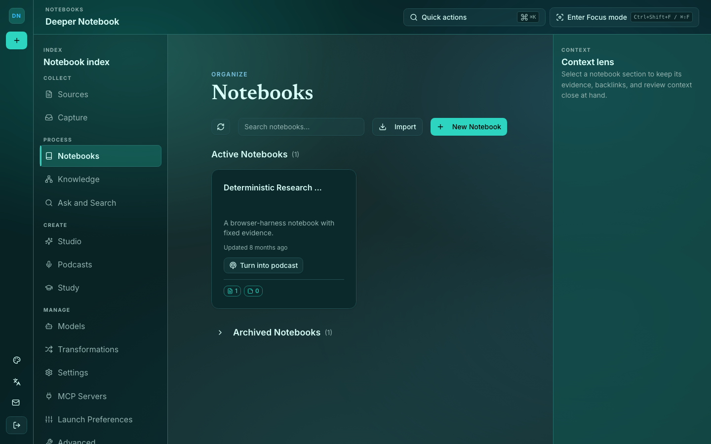
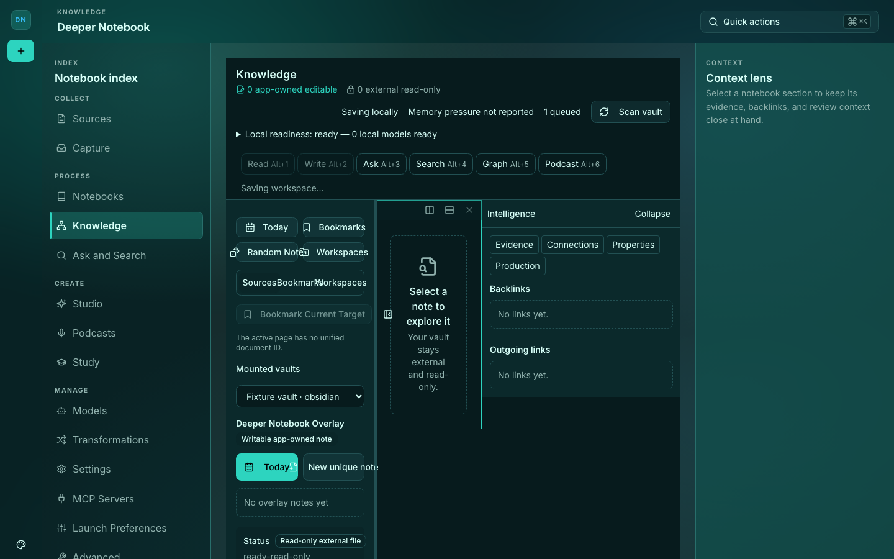
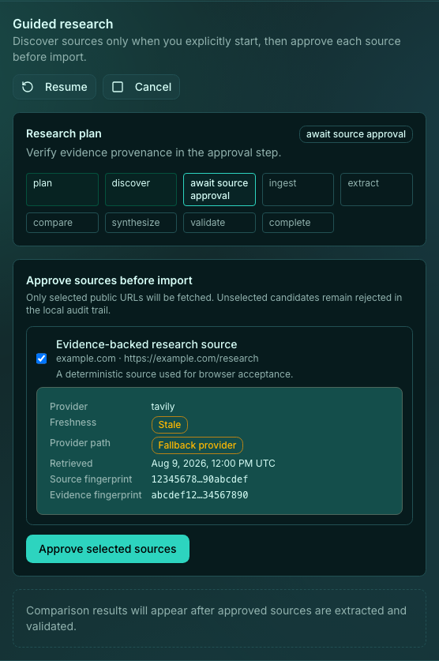
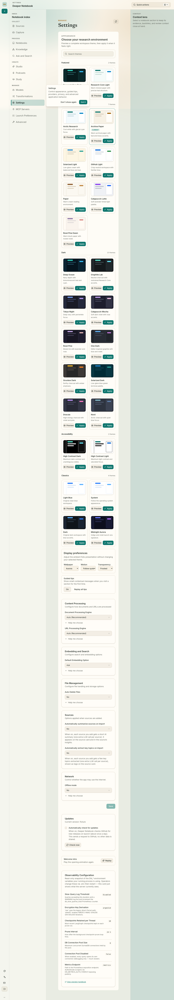
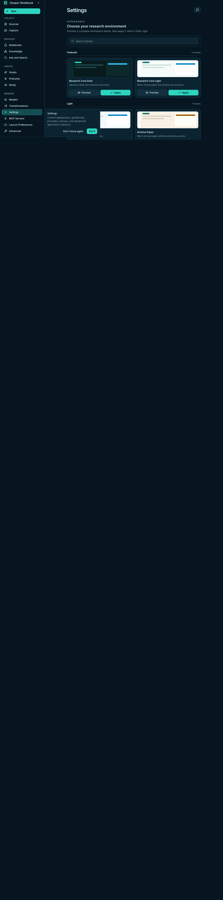
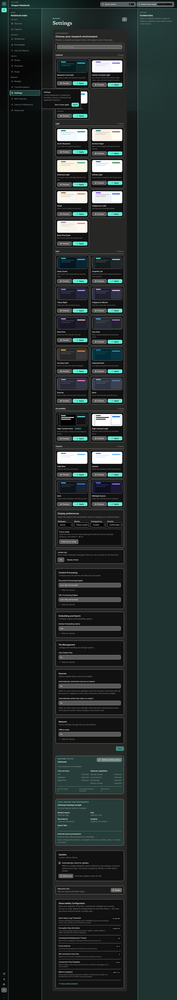
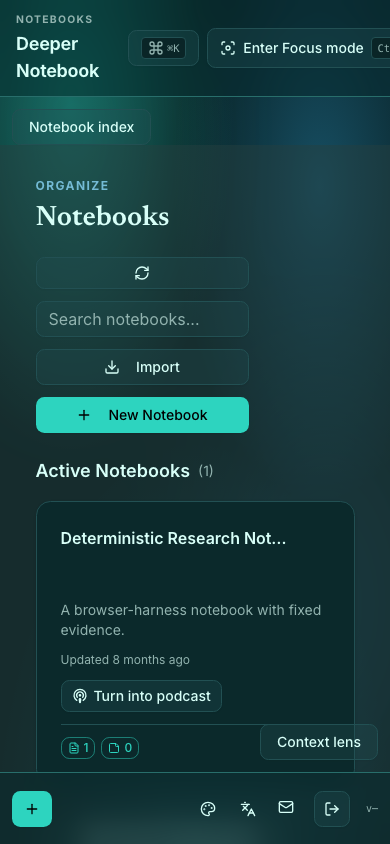

# Deeper Notebook

**Think further with every source.**

Deeper Notebook is a **local-first, source-grounded research and knowledge workspace** that
runs as a native desktop application. You collect documents, audio, video, and web pages
into notebooks; the app extracts, chunks, and embeds them; and from that point every answer
it gives you — chat replies, syntheses, study guides, podcast scripts, slide decks — is
grounded in *your* sources, with citations that jump back to the exact passage.

It is a substantially extended hard fork of
[`lfnovo/open-notebook`](https://github.com/lfnovo/open-notebook), adding a native desktop
launcher, bundled local AI sidecars, offline/online smart switching, a staged podcast
studio, Evidence Studio artifacts, a spaced-repetition study workbench, closed-loop memory,
a fail-closed privacy gate, and a source visual gallery.


The product uses the approved **Notebook Spark** visual identity with the teal-to-cyan
**Research Core** colorway. The canonical mark is [`brand/deeper-notebook-mark.svg`](brand/deeper-notebook-mark.svg).

[](https://opensource.org/licenses/MIT)


> **Snapshot:** desktop app `0.8.114` · server/container track `1.8.5` · 2026-08-21.
> Counts and measurements below were read from the tree at `58ff44b4`. Backend and desktop
> counts were re-collected this pass (`pytest --collect-only`); the frontend figure is
> carried over from the prior snapshot, not re-run. The two version numbers track different
> artifacts and are deliberately not reconciled — see [Two version tracks](#two-version-tracks).

> GitHub: **https://github.com/Antman1526/Deeper-Notebook** — downstream fork of
> [lfnovo/open-notebook](https://github.com/lfnovo/open-notebook).

---

## Table of Contents

- [What the application actually does](#what-the-application-actually-does)
- [The governing constraint](#the-governing-constraint)
- [Feature reference](#feature-reference)
- [Screens and routes](#screens-and-routes)
- [Screenshots](#screenshots)
- [Architecture](#architecture)
- [How it works — data flow](#how-it-works--data-flow)
- [Technology stack](#technology-stack)
- [Installation](#installation)
- [Configuration](#configuration)
- [Building from source](#building-from-source)
- [Running tests](#running-tests)
- [Security posture](#security-posture)
- [Recreating this project](#recreating-this-project)
- [Project structure](#project-structure)
- [Migrating from Open Notebook Plus](#migrating-from-open-notebook-plus)
- [Two version tracks](#two-version-tracks)
- [Privacy stance](#privacy-stance)
- [Contributing](#contributing) · [License](#license) · [Acknowledgements](#acknowledgements)

---

## What the application actually does

You open a native macOS app. It boots its own database, its own web server, and — if you
want them — its own AI models, all as child processes inside the app bundle. Nothing is
installed system-wide; nothing is required from the network.

**1. You create a notebook and add sources.**
Drag in a PDF, a Word document, a spreadsheet, a slide deck, an MP3, an MP4, or paste a URL
or raw text. The app extracts the text (`content-core` covers 50+ formats), transcribes
audio and video through a local Whisper sidecar, renders JavaScript-heavy pages through an
optional Crawl4AI engine, chunks the result, and embeds every chunk into SurrealDB. A
bounded visual extraction pass produces a cover image for the source (a PDF page, a video
frame, an audio waveform), cached as WebP under a 2 GiB ceiling.

**2. You chat, and the answers are grounded.**
Chat runs through a LangGraph state machine. Before the model sees your message, the graph
recalls what it has learned about you from previous sessions, retrieves the most relevant
chunks from your sources by vector similarity, and — if you are offline or have flipped the
offline toggle — swaps any cloud model for the best available local one. The model can call
tools: web search, scholarly search, adding a web page as a new source, or any Model
Context Protocol server you configure. Answers stream back token by token with citation
pills; clicking one opens the source and highlights the exact grounding passage.

**3. You turn sources into artifacts.**
Evidence Studio takes a set of ready sources and produces reports, study guides, Course
Packs, briefings, FAQs, timelines, flashcards, quizzes, data tables, mind maps, editable
`.pptx` slide decks, rendered infographics, podcast outlines, and research runs. These are
not free-form Markdown blobs — they are versioned Pydantic documents validated against a
schema, rendered deterministically to Markdown server-side, with visual exports written
beside them.

**4. You generate a podcast.**
Select sources and speaker profiles and the app produces a multi-speaker audio episode
through named stages (outline → transcript → audio → combine) with live progress and a
Cancel button. An optional review step pauses after the outline so you can edit segment
titles and pacing before any audio is synthesised. TTS can run entirely local through a
Piper sidecar.

**5. You study what you collected.**
The Study workbench schedules review with **FSRS** spaced repetition, builds study plans
from a notebook, and imports and exports Anki decks.

**6. Everything stays yours.**
The database file, the uploads, the embeddings, the chat history, and the extracted memory
all live under `~/.deeper-notebook/` on your drive, behind a password you set and an
encryption key you control. Cloud providers are opt-in, per-key, and can be turned off
entirely.

---

## The governing constraint

> **The entire product must work with the network cable unplugged.**

Inference, embeddings, speech-to-text, text-to-speech, the database, and the web server all
run as local processes. Cloud is an accelerant, never a prerequisite. Every architectural
decision in this repository follows from that sentence — the bundled runtimes, the two-venv
bootstrap, the offline gate, the keyless search fallback, and the fail-soft tool binding all
exist to keep it true.

---

## Feature reference

### Source ingestion
- **Formats:** PDF, DOCX, PPTX, XLSX, Markdown, plain text, HTML, audio, video, web URLs,
  pasted text. Extraction via `content-core`; audio/video via a local faster-whisper
  sidecar; dynamic pages via optional Crawl4AI + Playwright with graceful fallback.
- **Automatic embedding** into SurrealDB with HNSW vector indexes, so content is searchable
  and chat-able the moment ingestion finishes. Local `nomic-embed-text-v1.5` covers this
  with zero network calls.
- **Source Visual Gallery** — each source carries a cover image extracted from its own
  content (PDF page render, video keyframe, audio waveform), bounded per media type,
  cached as WebP, with zero mutation of the source row.
- **Opt-in enrichment on ingest** (both default OFF): auto-summarise into a Summary insight
  with a one-line card preview, and extract key topics into the source's `topics` tags.
- **Discover sources** — search the web from inside the Sources panel, review candidate
  URLs, add chosen results as link sources. Only reaches the network when a provider is
  configured.

### Grounded chat
- Answers cite their sources with **interactive citation pills**; clicking one opens the
  reading pane and scrolls to the highlighted grounding passage
  (`POST /sources/{id}/locate-passage`).
- **Per-source context control** — off / insights-only / full per source, with a
  "Using X of Y sources" indicator and a popover listing exactly what is in context.
- **Tools:** built-in `web_search`, `scholarly_search`, `add_web_source`, plus any MCP
  server you configure. Tool binding is **fail-soft** — a local model that cannot tool-call
  degrades to a plain answer rather than erroring.
- **Closed-loop memory** — facts, preferences, and episode summaries are extracted from
  each conversation and recalled into future ones, with bounded retention, batched
  extraction, a confidence floor, and prompt-injection sanitisation.
- **Source-grounding guardrail** — prompts instruct the model to answer only from the
  provided sources or say plainly that it cannot.

### Web and scholarly search
A **failover chain** with nested timeout budgets (25 s total; 10 s per paid attempt; 6 s per
keyless attempt), each attempt shrinking as the budget drains:

| Order | Provider | Key needed |
|---|---|---|
| 1 | Serper | yes |
| 2 | Tavily | yes |
| 3 | Brave | yes |
| 4 | SearXNG (self-hosted; `deploy/searxng-private/` ships one) | no |
| 5 | **Wikipedia** | **no** — guarantees search works with zero configuration |

A **paid** provider returning empty results ends the chain (that is a legitimate answer, and
falling through would double the bill for no information); a **free** provider returning
empty advances to the next. Scholarly search (OpenAlex, arXiv) is a separate keyless tool.

### Ask across the library
A retrieve-then-synthesise workflow over the whole notebook: pull the most relevant sources,
synthesise a cited answer, and **decline** with a CLARIFY result rather than emit an
ungrounded synthesis.

### Evidence Studio
- Reports, study guides, **Course Packs**, briefings, FAQs, timelines, flashcards, quizzes,
  data tables, mind maps, slide decks, infographics, podcast outlines, research runs.
- **Validated documents, not free text.** Provider-native structured output is preferred;
  plain-chat models receive the JSON Schema and get at most one bounded repair attempt.
  Invalid output fails closed.
- **Backward-compatible envelope** — each payload stores `schema_version`, the typed
  document, canonical Markdown, a legacy `content` alias, and a validation receipt. Older
  `{content: markdown}` artifacts keep working with no migration.
- **Visual exports** — slide decks save an editable 16:9 `.pptx` plus a multipage `.pdf`;
  infographics save a `.png` plus a one-page `.pdf`. Written by `python-pptx` and Pillow,
  locally, with no hosted office or image service.
- **Local Video Overview** — pair a completed deck with a timestamped Audio Overview to
  produce a captioned 1920×1080 `.mp4` plus `.vtt`, composed with the bundled FFmpeg,
  verified before promotion, served only through path-contained routes.
- **Approval gates** track context building, privacy review, model routing, and generation.
  Sources still processing produce a structured `sources_not_ready` response rather than
  thin material.

### Podcasts
Staged generation with per-stage progress and Cancel; optional outline review and edit
before audio; per-episode instructions stored and replayed on retry; BCP-47 language
selection; content token budgets enforced at submit so oversized selections fail fast.

### Study workbench
FSRS spaced repetition, study plans built from a notebook, Anki `.apkg` import and export
via `genanki`, and a scope-limited study assistant whose retrieval is post-filtered to the
plan's authorised sources.

**ExamLab** sits a timed exam over a quiz artifact: it snapshots the questions at start time
(so editing or regenerating the source artifact mid-attempt can never corrupt grading),
grades deterministically at submit with no model call, and can seed FSRS cards from missed
questions only — repeat seeding never double-creates a card for the same miss. Idea adopted
from PageLM's ExamLab; implementation is original.

**Debate mode** is a per-turn chat toggle, not a separate feature surface: with it on, the
same chat graph node renders `prompts/chat/debate.jinja` instead of the standard system
prompt, and the model is contracted to steelman the opposing position, concede when the
sources genuinely support the user, and cite every claim — still grounded in the notebook's
sources like ordinary chat.

**Cornell Notes** is a seeded transformation (cue column of recall questions, a note column,
a bottom summary), installed once at migration time alongside the existing default library —
it never touches a transformation you've edited. Idea adopted from PageLM's SmartNotes;
implementation is original.

### Knowledge engine and vault
Document/block/relation projection over your corpus, an interactive React Flow mind map of
the notebook hub and its sources and notes (grounded in the existing `reference`/`artifact`
edges — no schema change), Markdown vault sync compatible with Obsidian and Logseq, and
daily-note overlay spaces.

### Offline / online switching
A network-state service probes connectivity with caching and passive flips from real cloud
call results. When offline — by circumstance or by the Settings → Network toggle — any turn
routed to a cloud model is transparently substituted with the best local model instead of
hanging. An amber "Offline — answering with `<model>`" badge appears in the shell and each
affected message carries an "Answered with `<model>` (offline)" pill. Opt-in **smart
routing** picks local vs cloud per turn based on context size and sidecar health.

### Local AI
Bundled `llama-cpp-python` chat and embedding servers, Apple-Silicon **MLX** server support,
Ollama auto-detection, and a **GGUF Manager** for downloading models from Hugging Face and
hot-swapping at runtime. Drop a `.gguf` into the GGUF model root and it appears in the
picker on next launch; place complete MLX repos under the MLX root; `ollama pull <name>`
makes Ollama models available.

### Operations
- `X-Request-ID` on every response, request-correlated logs, and a Prometheus `/metrics`
  endpoint covering request latency, DB query latency, slow-query counts, memory-recall
  fall-through reasons, checkpoint-prune cycles, and privacy-gate / tool-loop counters.
- **Startup receipts** at `~/.deeper-notebook/startup_receipt.json` record staged timings;
  stages over 100 ms surface in the UI, so a slow launch is diagnosable without opening a
  log directory.
- **Per-sidecar stderr capture** to rolling `.tail` files, exposed via
  `/healthz/sidecars/{kind}/log` — a crashed sidecar reports its actual cause instead of a
  stale "down" badge.
- **Backup and restore** with atomic writes, an embedded SHA-256 manifest, a versioned
  bundle format, and interval auto-export.
- **Self-healing database** — detects SurrealDB live-query corruption after an unclean
  shutdown and runs a backup-first auto-repair on next launch, with a "Repair & restart"
  button that relaunches through the desktop bridge.

### Accessibility and theming
ARIA labels on icon-only controls, Radix-managed dialog focus trap and restore, 17 WCAG
AA/AAA themes, list virtualisation, rAF-batched streaming, a persisted **density
preference** (Comfortable by default), and compositor-only motion that disables completely
under `prefers-reduced-motion`. 15 UI locales.

---

## Screens and routes

| Route | What it is |
|---|---|
| `/` | Workspace home — recent sources, notebooks, runtime status |
| `/notebooks`, `/notebooks/[id]` | Notebook index and the three-pane workspace (`sources │ notes │ chat`), resizable with remembered widths |
| `/sources`, `/sources/[id]` | Source library, gallery, and the reading pane with inline PDF rendering (offline pdf.js worker, no CDN) |
| `/search` | Semantic + keyword search across the library |
| `/knowledge` | Knowledge engine — documents, blocks, relations, mind map |
| `/studio` | Evidence Studio |
| `/podcasts`, `/podcasts/studio` | Episode library and the staged generation studio |
| `/study`, `/study/plans/[planId]` | FSRS review, plans, Anki import/export |
| `/transformations` | Reusable named prompt templates + the SkillOpt optimizer |
| `/capture` | Filesystem capture inbox (watchdog) |
| `/advanced` | Power-user tools and diagnostics |
| `/settings` | Models, sources, network, privacy, appearance |
| `/settings/api-keys` | Encrypted provider credentials |
| `/settings/local-models` | GGUF / MLX / Ollama management and health |
| `/settings/mcp` | MCP server configuration |
| `/settings/launcher-prefs` | Ports, model selection, launch behaviour |
| `/setup-wizard` | First-run onboarding, including "Explore a sample notebook" |
| `/login` | Password gate |

---

## Screenshots

These are the same deterministic baselines the mocked-browser visual release gate compares
against, so they are guaranteed to match what the app renders at this commit.

**Notebook index — Research Core theme**



**Knowledge workspace**



**Research evidence receipt**



**Theming — Archive Paper, Deep Ocean, and High Contrast**







**Responsive — 390×844**



---

## Architecture

Three tiers plus, in the desktop build, a supervisor that manages nine or more local child
processes on dynamically allocated ports.

```
┌───────────────────────────────────────────────────────────────────────┐
│ PyWebView 5.4 native macOS shell                                      │
│   downloads disabled · devtools off · external links → system browser │
│   one JS bridge method (relaunch) · loads only the local Next origin   │
└──────────────────────────────┬────────────────────────────────────────┘
                               │ loads
┌──────────────────────────────▼────────────────────────────────────────┐
│ Frontend   Next.js 16.2 · React 19.2 · TypeScript 5      dynamic port │
│   App Router (standalone output) · Zustand · TanStack Query 5         │
│   Radix + Tailwind 4 · Zod at every API boundary · i18n (15 locales)  │
└──────────────────────────────┬────────────────────────────────────────┘
                               │ REST + SSE + NDJSON  (/api rewrites)
┌──────────────────────────────▼────────────────────────────────────────┐
│ API        FastAPI 0.136+ · Python 3.12.14               dynamic port │
│   279 route handlers across 47 router modules                         │
│   LangGraph 1.0 workflows: chat · ask · source · source_chat ·        │
│                            transformation · agent_fsm                 │
│   Esperanto multi-provider model layer · surreal-commands job queue   │
│   Pydantic v2 · request-ID middleware · Prometheus /metrics           │
└──────────────────────────────┬────────────────────────────────────────┘
                               │ SurrealQL (AsyncSurreal pool, size 4)
┌──────────────────────────────▼────────────────────────────────────────┐
│ Database   SurrealDB 2.1.0 (bundled binary)              dynamic port │
│   Graph + document + vector + KV in one engine                        │
│   ~75 tables · 92 migrations · HNSW indexes                           │
│   vector::similarity::cosine · cascade DEFINE EVENTs                  │
└───────────────────────────────────────────────────────────────────────┘

desktop/launcher.py additionally supervises:
  • llama-cpp-python embed server    (nomic-embed-text-v1.5 GGUF)
  • llama-cpp-python chat server     (any GGUF you select)
  • mlx_lm.server                    (Apple Silicon, optional)
  • faster-whisper STT sidecar
  • piper-tts TTS sidecar
  • mem0 memory shim                 (FastMCP micro-service)
  • OpenChronicle shim               (FastMCP micro-service)
  • surreal-commands worker          (podcasts, embeddings, visuals, ingestion)
  • bundled SurrealDB + Node.js runtimes
```

**Every service binds `127.0.0.1`.** Nothing listens off-loopback. Ports are allocated per
launch, which is why every credential's `base_url` is refreshed by `auto_register` before
the UI opens.

### The two-venv bootstrap

The `.app` ships a frozen PyInstaller launcher venv *and* provisions a second, user-owned
venv at `~/.deeper-notebook/venv` with `uv`. Heavy ML dependencies do not freeze cleanly,
and a user venv can be repaired without reinstalling the app.

Both layers are **stamped** so a runtime bump actually propagates to existing installs:

- The extracted runtime is keyed to the SHA-256 of the tarball that produced it.
- The venv marker keys on **interpreter identity + lock hash**, where interpreter identity
  includes the OpenSSL version — deliberately, because Wikimedia's edge returns HTTP 403 to
  the OpenSSL 3.0 TLS fingerprint, and that is exactly the class of defect a runtime bump
  must be able to deliver.

### Layering rules

```
desktop/  ──▶ api/  ──▶ deeper_notebook/  ──▶ database/  ──▶ SurrealDB
frontend/ ──HTTP──▶ api/
```

- `deeper_notebook/` must **not** import `api/` or `desktop/`.
- `api/` may import `deeper_notebook/`; never `desktop/`.
- `domain/` must not import the chat graph — which is why notebook deletion cascades chat
  sessions in the domain layer but leaves LangGraph checkpoint cleanup to the router.

---

## How it works — data flow

**Ingest a source**
```
Upload file / URL / text
  → POST /api/sources dispatches a surreal-commands job
  → source LangGraph: extract (content-core / Crawl4AI / Whisper)
                    → chunk → embed (local or cloud embedder)
                    → write source row + source_embedding chunks
                    → RELATE notebook -> reference -> source
  → optional bounded visual extraction → cached WebP cover
  → frontend polls job status; the source appears when ready
```

**Chat with your sources**
```
User message → POST /api/chat (SSE)
  → chat LangGraph:
      recall_memory()        cosine over memory_fact / preference / episode, budget-capped
      → offline gate         cloud candidate + offline ⇒ substitute local model
      → retrieve context     HNSW vector search over source_embedding, char-capped
      → bind_tools()         FAIL-SOFT: bind failure ⇒ degrade to no-tools, reset lookup
      → model invoke         tool_calls? → execute → ToolMessage → re-invoke (max 4)
  → tokens stream back; captures render as citation pills
  → after the turn: fire-and-forget memory extraction writes facts / preferences
```

**Ask across the library**
```
Question → ask LangGraph: retrieve top-k relevant sources notebook-wide
                        → synthesise a cited answer, or declare CLARIFY
```

**Generate a podcast**
```
Sources + episode/speaker profiles → POST /api/podcasts (job)
  → staged graph: outline → [optional review & edit] → transcript
                → audio (TTS) → combine → playable MP3
  → per-stage progress written to the episode; Cancel polled every ~5 s
```

**Generate an Evidence Studio artifact**
```
Ready sources → citation-marked context + artifact JSON Schema
  → provider-native structured output, or schema-in-prompt fallback
  → validate → [one bounded repair when invalid] → else fail closed
  → deterministic Markdown renderer
  → save v1 document + Markdown + content alias + validation receipt
  → sidecar exports: slide_deck → editable PPTX + multipage PDF
                     infographic → PNG + one-page PDF
  → valid structured edits keep a revision and refresh every export
```

**Startup**
```
config.toml → 16 phases
  → bootstrap: stamped runtime extraction + stamped venv provisioning
  → supervisor spawns 9+ sidecars on dynamic ports
  → auto_register refreshes every credential base_url for this launch
  → phase-1 health probes → runtime snapshot → UI opens
```

---

## Technology stack

| Layer | Technology | Version |
|---|---|---|
| Desktop shell | PyWebView | 5.4 (exact pin) |
| Packaging | PyInstaller | 6.13+ |
| Bundled interpreter | python-build-standalone CPython | 20260814 / 3.12.14 |
| Bundled DB | SurrealDB | 2.1.0 |
| Bundled Node | Node.js | 20.18.0 |
| Bundled installer | uv | 0.5.11 |
| Frontend framework | Next.js | 16.2 |
| UI library | React | 19.2 |
| Language (frontend) | TypeScript | 5 |
| State / server state | Zustand 5 · TanStack Query 5 | — |
| Components | Radix UI + Tailwind CSS | Radix 1.x / Tailwind 4 |
| Editor | CodeMirror 6 · `@uiw/react-md-editor` · react-markdown | — |
| Graph canvas | `@xyflow/react` | 12 |
| Validation (client) | Zod | 4 |
| i18n | i18next / react-i18next | 25 / 16 |
| API framework | FastAPI | 0.136.3+ |
| Language (backend) | Python | 3.11–3.12 (3.12.14 runtime) |
| Workflow engine | LangGraph | 1.0.10+ |
| LLM glue | LangChain + per-provider packages | 1.x |
| Multi-provider layer | Esperanto | 2.20+ |
| Validation (server) | Pydantic | v2 |
| Job queue | surreal-commands | 1.3+ |
| Logging | Loguru | — |
| Database | SurrealDB | 2.x |
| DB driver | `surrealdb` (AsyncSurreal) | 1.x |
| Content extraction | content-core | 1.14+ |
| Prompt templating | ai-prompter (Jinja2) | 0.4+ |
| Podcasts | podcast-creator | 0.12+ |
| Local LLM runtimes | llama-cpp-python · mlx-lm · Ollama | 0.3.x · 0.31.x · — |
| Local embeddings | nomic-embed-text-v1.5 (GGUF) | — |
| Local STT / TTS | faster-whisper · piper-tts | 1.1+ · 1.2+ |
| Memory | mem0ai + custom SurrealDB vector store | 2.0.18+ |
| Spaced repetition | fsrs · genanki | 6.3+ · 0.13.1 |
| Video composition | imageio-ffmpeg | 0.6+ |
| Web search | Serper · Tavily · Brave · SearXNG · Wikipedia | — |
| Scholarly | OpenAlex · arXiv | — |
| MCP | `mcp` client · `fastmcp` server | 1.28+ · 3.x |
| Prompt optimizer | Microsoft SkillOpt | 0.1.x |
| Metrics | prometheus-client | 0.20+ |
| Tests | pytest 9 · pytest-asyncio 1.2 · Vitest 4 · Playwright 1.61.1 | — |
| Quality | ruff · mypy · pre-commit · bandit · pip-audit · gitleaks | — |
| Package managers | `uv` (Python) · `npm` (JS) | — |

The exhaustive inventory — every dependency with its **specific role in this codebase** —
is [`docs/recreation/TECHNOLOGY-AUDIT.md`](docs/recreation/TECHNOLOGY-AUDIT.md).

---

## Installation

### Desktop app (macOS)

1. Download `Deeper-Notebook-mac-<arch>.dmg` from
   [Releases](https://github.com/Antman1526/Deeper-Notebook/releases).
2. Drag **Deeper Notebook** into **Applications**.
3. The build is signed with a stable self-signed identity but is **not notarized**, so the
   first launch of a fresh DMG needs **Right-click → Open** to clear Gatekeeper.
4. On first run the app extracts its bundled runtimes, provisions its user venv, downloads
   the local model files it needs, and opens on a splash before handing off to the main UI.
   Expect roughly 90 seconds of one-time provisioning.

> **Windows:** desktop builds are produced on a Windows host — PyInstaller is not a
> cross-compiler. Releases provide `Deeper-Notebook-windows-x64.zip` and
> `Deeper-Notebook-Setup-x64.exe`.

### Development from source

Requirements: **Python 3.12**, [`uv`](https://github.com/astral-sh/uv), **Node 20+** with
`npm`, and **SurrealDB 2.x**.

```bash
git clone https://github.com/Antman1526/Deeper-Notebook.git
cd Deeper-Notebook

uv sync                 # creates .venv and installs Python dependencies
cp .env.example .env    # then fill in the values below

cd frontend && npm ci && cd ..
```

Run the three tiers in three terminals:

```bash
make database    # SurrealDB
make api         # FastAPI on :5055
make frontend    # Next.js on :3000
```

Open **http://localhost:3000**, enter your `DEEPER_NOTEBOOK_PASSWORD` if you set one, create
a notebook, add a source, and start chatting.

> A self-host **Docker Compose** path also exists (`docker compose up -d`) for the server
> track. **The desktop app never runs in Docker.**

---

## Configuration

Configuration comes from **environment variables** (a `.env` file in development, copied
from `.env.example`) and an optional **`config.toml`** for non-secret settings. There are
**151 registered settings**; `resolve_env` applies a strict precedence:

```
DEEPER_NOTEBOOK_*  →  DN_*  →  OPEN_NOTEBOOK_*  →  ONP_*
```

Legacy names remain readable and emit a deprecation notice naming only the variable, never
its value.

Application data — the SurrealDB store, uploads, checkpoints, logs, the user venv, and the
tiktoken cache — lives under `DATA_FOLDER` (default `./data` in dev; `~/.deeper-notebook/`
in the desktop build). **Never delete `~/.deeper-notebook/` as part of a build or install
step.**

Local models are read from the model root (`~/Desktop/AI_Models` on macOS by default):
GGUF files under `GGUF/`, complete MLX repositories under `MLX/`. Ollama models are
auto-detected from the running service. Encrypted cloud credentials are added in-app under
**Settings → API keys**, not via env vars.

Minimum set (names only — never commit real values):

```bash
# --- SurrealDB ---
SURREAL_URL=ws://localhost:8000/rpc
SURREAL_USER=
SURREAL_PASSWORD=
SURREAL_NAMESPACE=open_notebook
SURREAL_DATABASE=production

# --- App auth & secret storage (required) ---
DEEPER_NOTEBOOK_PASSWORD=            # UI password gate
DEEPER_NOTEBOOK_ENCRYPTION_KEY=      # encrypts stored provider credentials (≥16 chars)
# DEEPER_NOTEBOOK_ENCRYPTION_KEYS=new,old   # rotation without re-entering credentials
# DN_ENCRYPTION_KDF=pbkdf2

# --- Data location ---
DATA_FOLDER=./data

# --- Optional: web search (opt-in by key presence; Wikipedia needs none) ---
SERPER_API_KEY=
TAVILY_API_KEY=
BRAVE_API_KEY=
SEARXNG_BASE_URL=

# --- Optional: routing, privacy, memory, FSM (all default-off) ---
DEEPER_NOTEBOOK_AUTO_ROUTE_CHAT=
DN_PRIVACY_GATE=
DN_AGENT_FSM=
DN_MEMORY_RECALL_MODE=              # recent | semantic | auto
DN_MEMORY_KEEP_PER_TABLE=
DN_MEMORY_BATCH_TURNS=
DN_MEMORY_CONFIDENCE_FLOOR=

# --- Optional: offline / network behaviour ---
DN_NET_PROBE_HOSTS=
DN_NETWORK_STATE_TTL_SEC=

# --- Optional: observability & maintenance ---
DN_SLOW_QUERY_LOG_MS=500
DN_CHECKPOINT_KEEP_PER_THREAD=50
DN_CHECKPOINT_PRUNE_INTERVAL_HOURS=24

# --- Optional: podcast & prompt optimizer ---
DN_PODCAST_MAX_CONTENT_TOKENS=100000
DN_PROMPT_OPT_TIMEOUT_SEC=1800

# --- Optional: desktop auto-export ---
DN_AUTO_EXPORT_HOURS=24
DN_AUTO_EXPORT_KEEP=7
```

Full reference: [`docs/5-CONFIGURATION/`](docs/5-CONFIGURATION/index.md) and
[`docs/recreation/09-configuration-environment-variables.md`](docs/recreation/09-configuration-environment-variables.md).

> **Frontend feature flags are frozen at build time.** `NEXT_PUBLIC_*` values are inlined by
> `next build`, so a packaged app cannot roll back a UI feature through configuration. Any
> flag that needs to be rollback-able must have a backend counterpart — see the capability
> sentinel pattern in
> [`PROJECT-DEEP-DIVE.md`](docs/recreation/PROJECT-DEEP-DIVE.md).

---

## Building from source

```bash
make build-mac
# test → lockfile → build venv → Next.js build → fetch runtimes →
# PyInstaller → hdiutil dmg
#
# Outputs: dist/Deeper Notebook.app
#          dist/Deeper-Notebook-mac-<arch>.dmg
```

```bash
make build-mac-install    # install the built .app into /Applications
```

Runtimes are fetched by `desktop/build/fetch_runtimes.py`, SHA-256 verified with
`hmac.compare_digest`, and staged-then-atomically-replaced so a failed download cannot
clobber a verified artifact. Archive members are path-traversal validated before extraction.

Code signing uses a **stable self-signed identity** created by
`scripts/create-signing-identity.sh`. This matters: ad-hoc signing resets macOS TCC grants
on every rebuild, which presents as a silent launch wedge. Two script details worth knowing:
self-signed certs must be trusted with `-r trustRoot` (not `trustAsRoot`), and existence
checks must not use `find-identity -v`, which hides untrusted identities.

Verify a signed bundle with `codesign -dvv` — `-dv` is not enough.

---

## Running tests

```bash
make test                 # backend: hermetic unit/graph tests (no live services)
make test-integration     # backend: SurrealDB integration tests (run `make database` first)
cd frontend && npm test   # frontend: Vitest
cd frontend && npm run test:e2e:mocked   # Playwright, mocked-browser project
make security-scan        # bandit (HIGH) + pip-audit over desktop/requirements.lock
```

Current counts: **4,906 backend**, **940 desktop**, **1,832 frontend** unit tests, plus
Playwright projects `mocked-browser`, `native-runtime`, and `packaged-device`.

Desktop packaging runs the launcher suite, all non-integration backend files through a
bounded cross-platform batch runner, and frontend lint + build before packaging. CI:
[`.github/workflows/test.yml`](.github/workflows/test.yml); release runner:
[`desktop/build/run_backend_tests.py`](desktop/build/run_backend_tests.py).

Frontend tests run `--pool=forks --maxWorkers=1` and Playwright runs `workers: 1` — parallel
workers made the jsdom and visual suites flaky, and loosening a budget would discard the
signal the test exists for.

---

## Security posture

As of 2026-08-21: **Bandit HIGH in project code 0** · **B608 findings 0** (down from 79) ·
project MEDIUMs 4, all triaged false positives · pip-audit residuals 2, both documented.
Full triage: `docs/verification/2026-08-16-security-scan.md`.

**Threat model.** Single-user, local-first, everything on loopback. The real adversaries are
malicious content (a hostile PDF, page, or vault file), model-directed action (the LLM
induced to fetch or ingest something), the supply chain, and other local processes.
Multi-tenant isolation and network attackers are out of scope — nothing listens off-loopback.

- **SSRF boundary** (`security/outbound_url.py`) — fail-closed. Resolves and checks *every*
  returned address, so DNS rebinding into a private range is refused; rejects non-canonical
  IP literals that Python's URL parser accepts but network stacks interpret differently.
  Model-callable ingestion never hands a raw URL to `content-core`, whose fetcher has a
  different localhost policy.
- **SurrealQL injection** — identifiers may be interpolated only after whitelist validation;
  values always travel as `$`-bound parameters; record ids go through `ensure_record_id`.
- **Encryption at rest** — provider keys encrypted in the `credential` table, with multi-key
  rotation so rotating does not mean re-entering a dozen keys.
- **Bounded parsers** — arXiv XML capped at 5 MB before parse; stdlib `etree` resolves no
  external entities.
- **Shell hardening** — downloads off, devtools off, external links to the system browser,
  one JS bridge method, local origin only.
- **Secret hygiene** — `gitleaks` on staged changes and over the full push range.

---

## Recreating this project

[`docs/recreation/`](docs/recreation/) is a source-controlled packet written so another AI
system or a senior engineer can rebuild this project without guessing — real code snippets,
exact versions, measured numbers, and explicit uncertainty notes. Regenerated 2026-08-21
against `main` @ `58ff44b4`.

| Document | Coverage |
|---|---|
| [`01`](docs/recreation/01-project-overview-architecture.md) | Three-tier runtime, 16 startup phases, sidecars, two-venv bootstrap, invariants |
| [`02`](docs/recreation/02-environment-setup-dependencies.md) | Exact versions, runtime pins, dependency lists, build stages, environment traps |
| [`03`](docs/recreation/03-database-schema-data-models.md) | 92 migrations, ~75 tables, DDL, cascade events, graph edges, `repo_query` |
| [`04`](docs/recreation/04-backend-api-specifications.md) | Routers, routes, auth dependency, error contract, timeout budgets |
| [`05`](docs/recreation/05-frontend-architecture-components.md) | Shell, grid, stores, notebook design CSS, source gallery, tool picker |
| [`06`](docs/recreation/06-authentication-authorization.md) | Threat model, credential encryption and rotation, capability boundaries |
| [`07`](docs/recreation/07-business-logic-core-algorithms.md) | Chat tool loop, search chain, offline gate, visuals, health probing |
| [`08`](docs/recreation/08-integration-points-external-services.md) | Providers, local inference, search, scholarly APIs, MCP, update check |
| [`09`](docs/recreation/09-configuration-environment-variables.md) | 151 settings, precedence, `config.toml`, setting families, test-isolation trap |
| [`10`](docs/recreation/10-testing-strategy-test-cases.md) | Test counts, source-shape guards, browser matrices, runtime budgets, flakes |
| [`11`](docs/recreation/11-build-deployment-pipeline.md) | Stage graph, gate with preflight and retry, signing, post-build verification |
| [`12`](docs/recreation/12-error-handling-logging.md) | Exception taxonomy, degradation patterns, log sinks, debugging playbook |
| [`13`](docs/recreation/13-performance-optimization-caching.md) | Measured wins, client pooling, TTL caching, nested budgets, model-store layout |
| [`14`](docs/recreation/14-security-implementation.md) | SSRF, B608 burn-down, rebrand governance, dependency security |
| [`15`](docs/recreation/15-file-structure-code-organization.md) | Directory map, naming conventions, version-comment convention, layering |
| [`PROJECT-DEEP-DIVE.md`](docs/recreation/PROJECT-DEEP-DIVE.md) | Annotated real code, data flow, pain points, trade-offs, **Areas for Review** |
| [`TECHNOLOGY-AUDIT.md`](docs/recreation/TECHNOLOGY-AUDIT.md) | Every technology with its specific role here, plus notable absences and why |

These files can also be loaded into Deeper Notebook itself as source material — the app is
useful for reasoning about its own documentation.

---

## Project structure

```
Deeper-Notebook/
├── api/                      # FastAPI app — HTTP layer only
│   ├── main.py               #   app assembly, lifespan, exception handlers
│   ├── auth.py               #   check_api_password dependency
│   ├── command_service.py    #   surreal-commands wrapper (submit/list/cancel)
│   ├── routers/              #   47 modules, one per surface
│   └── schemas/              #   per-feature strict Pydantic schemas
├── deeper_notebook/          # the business core (25 subsystems)
│   ├── domain/               #   ObjectModel base + Notebook, Source, Note, Credential
│   ├── database/             #   repo_query, async_migrate, migrations/ (92)
│   ├── graphs/               #   chat, ask, source, source_chat, transformation, agent_fsm
│   ├── ai/                   #   provider resolution, offline_gate, model_discovery
│   ├── tools/                #   web_search, scholarly_search, add_web_source, opencode
│   ├── source_visuals/       #   authority, extractors, media, queue, storage, cleanup
│   ├── knowledge_engine/     #   document/block/relation projection
│   ├── vault/  overlay/      #   Markdown vault sync · daily-note spaces
│   ├── study/                #   FSRS scheduling, plans, Anki, scope-limited assistant
│   ├── podcasts/  studio/    #   episode generation · Evidence Studio workflows
│   ├── video/  research/     #   Video Overview composition · discovery + safe_fetch
│   ├── capture/  analysis/   #   watchdog inbox · claim extraction and verdicts
│   ├── health/  security/    #   local_models, network · outbound_url, mcp_transport
│   ├── mcp/  local_models/   #   MCP client · role routing and planner
│   ├── prompt_optimizer/     #   SkillOpt integration
│   ├── environment.py        #   151 registered settings, alias precedence
│   ├── feature_flags.py      #   6 backend flags
│   └── exceptions.py         #   typed exception hierarchy
├── open_notebook/            # upstream import-compatibility shim
├── commands/                 # surreal-commands job handlers
├── desktop/                  # native shell
│   ├── app.py                #   16 startup phases
│   ├── launcher.py           #   supervisor: 9+ sidecars, dynamic ports, process groups
│   ├── bootstrap.py          #   stamped runtime extraction + venv provisioning
│   ├── window.py             #   PyWebView window, theme injection, security settings
│   ├── providers/            #   mlx.py, llamacpp.py
│   ├── auto_register/        #   per-launch credential/model registration
│   ├── desktop_shims/        #   memory + OpenChronicle FastMCP micro-services
│   ├── memory/               #   surreal_store.py — mem0 vector store on SurrealDB
│   ├── build/                #   pyinstaller.spec, fetch_runtimes, runtimes.toml, dmg
│   └── tests/                #   940 desktop tests
├── frontend/                 # Next.js 16 + React 19
│   ├── src/app/              #   (auth) and (dashboard) route groups
│   ├── src/components/       #   ui/ layout/ deeper-notebook/ chat/ sources/ study/ …
│   ├── src/lib/              #   api clients, hooks, zustand stores, zod types
│   └── e2e/                  #   Playwright specs + fixtures
├── scripts/                  # rebrand_audit, backup_restore, signing identity, verifiers
├── prompts/                  # Jinja templates (ai-prompter)
├── tests/                    # 4,906 backend tests (+ tests/integration/)
├── docs/                     # user docs, configuration reference, recreation packet,
│                             #   verification receipts
├── deploy/searxng-private/   # ship-your-own localhost SearXNG
├── pyproject.toml            # Python deps (uv) — server/container version track
├── Makefile                  # database / api / frontend / test / security / build-mac
└── desktop/CHANGELOG.md      # downstream release record
```

---

## Migrating from Open Notebook Plus

| Setting | Canonical | Legacy compatibility |
|---|---|---|
| Long environment prefix | `DEEPER_NOTEBOOK_*` | `OPEN_NOTEBOOK_*` |
| Short environment prefix | `DN_*` | `ONP_*` |
| macOS/Linux data directory | `~/.deeper-notebook/` | `~/.open-notebook-plus/` |
| Windows data directory | `%USERPROFILE%\.deeper-notebook` | `%USERPROFILE%\.open-notebook-plus` |

Canonical variables win when both are set. Fresh profiles use the canonical directory. A
legacy-only profile is migrated only through the guarded receipt-and-validation flow. **If
both directories exist with different state, the app enters recovery mode and does not merge
or write either one.** Keep the legacy directory until the migration receipt and
before/after hashes have been verified.

Product identity is enforced by `scripts/rebrand_audit.py`, which classifies every
legacy-name occurrence and fails the build if any is an `unexpected_active_identity`.
Compatibility aliases and the historical bundle identifier are deliberate migration
contracts — do not remove them as a cosmetic rename.

---

## Two version tracks

| Track | File | Current | What it versions |
|---|---|---|---|
| Desktop app | `desktop/__init__.py` | `0.8.114` | The `.app` / `.dmg`, the window, `/api/version`, the update-notifier baseline |
| Server / container | `pyproject.toml` | `1.8.5` | The Docker image tagged by `build-and-release.yml`, inherited from upstream |

They version different artifacts and are intentionally **not** reconciled.

---

## Privacy stance

- **Your data stays on your drive.** Notebooks, sources, embeddings, chat history, and
  extracted memory live in your SurrealDB, behind your password and encryption key.
- **Fully local AI is a first-class path, not a fallback.** Bundled chat, embedding, STT,
  and TTS sidecars mean ingestion, chat, search, memory, and podcast audio can run with
  zero network calls.
- **Fail-closed privacy gate.** With `DN_PRIVACY_GATE` enabled, turns containing detected
  secrets or PII stay on the local model or are blocked, surfaced by an "On-device" badge
  with an explicit **"Re-ask allowing cloud"** consent action.
- **Offline by choice or by circumstance.** Flip the toggle and the app runs fully local
  even when online; lose connectivity and cloud turns fall back instead of hanging.
- **Encrypted credentials.** Cloud API keys are stored encrypted (Fernet, optional
  PBKDF2-HMAC-SHA256 KDF, multi-key rotation), never in plaintext.
- **Nothing is logged that shouldn't be.** No API keys — including inside exception text
  from providers that echo request bodies — no encryption keys, no source content, no note
  bodies, no full record payloads.

---

## Contributing

See [`CONTRIBUTING.md`](CONTRIBUTING.md) for guidelines and [`CLAUDE.md`](CLAUDE.md) for the
architectural conventions this codebase follows. Component-level guidance lives in nested
`CLAUDE.md` files under `frontend/`, `api/`, and `deeper_notebook/`.

Before opening a PR, run `make test`, the frontend Vitest suite, and
`python scripts/rebrand_audit.py --check`, and add tests for any behaviour change.

One convention is worth adopting deliberately: **non-obvious code carries a version marker
plus the failure it prevents.**

```python
# v0.7.198 — Wait for the chat server to actually bind its port BEFORE spawning
# the memory retriever. llama-cpp typically takes 10-30 s to mmap a multi-GB
# GGUF; without this gate, mem0.Memory's startup validation hit a closed port
# and the memory child exited rc=1 silently (production-mode DEVNULL).
```

A comment explaining *what* the code does is redundant; one explaining *why it must* is
load-bearing.

Downstream issues: [Deeper-Notebook issues](https://github.com/Antman1526/Deeper-Notebook/issues).
Upstream issues: [lfnovo/open-notebook](https://github.com/lfnovo/open-notebook/issues).

---

## License

**MIT** — see [`LICENSE`](LICENSE). Same license as upstream.

---

## Acknowledgements

Deeper Notebook is a downstream fork of
[`lfnovo/open-notebook`](https://github.com/lfnovo/open-notebook); all upstream credit goes
to [@lfnovo](https://github.com/lfnovo). The downstream native desktop, local-AI, privacy,
memory, study, and research-workspace extensions are maintained by
[@Antman1526](https://github.com/Antman1526). The prompt optimizer builds on Microsoft
**SkillOpt** (MIT).
