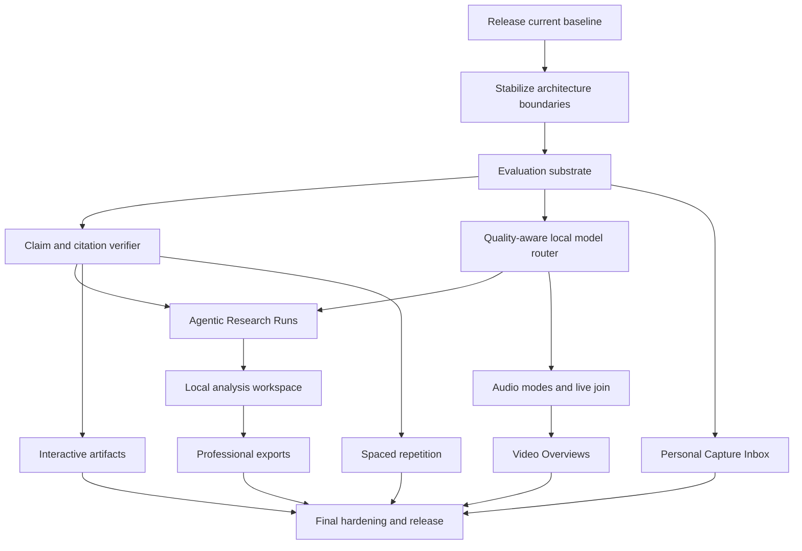

# Private Research Workbench Master Implementation Plan

> **For agentic workers:** REQUIRED SUB-SKILL: Use superpowers:subagent-driven-development (recommended) or superpowers:executing-plans to implement this plan task-by-task. Steps use checkbox (`- [ ]`) syntax for tracking.

**Goal:** Evolve Open Notebook Plus into the strongest single-user, private research and learning workbench in its class by adding evidence validation, quality-aware local-model routing, agentic research, interactive artifacts, professional exports, richer audio/video, personal capture, and spaced repetition without introducing user accounts or weakening offline operation.

**Architecture:** Preserve the existing Next.js/FastAPI/SurrealDB/LangGraph desktop architecture and add narrowly bounded services behind stable API contracts. Build trust and evaluation primitives first because every later workflow depends on them. Deliver each capability as a vertical slice with backend contracts, persistence, API, frontend, tests, packaged-app proof, and a reversible commit before beginning the next slice.

**Tech Stack:** Python 3.11/3.12, FastAPI, Pydantic 2, LangGraph 1.x, SurrealDB, surreal-commands, Next.js 16, React 19, TypeScript 5, TanStack Query 5, Zustand 5, Tailwind CSS 4, Vitest 4, pytest 9, React Flow 12, python-docx 1.2, openpyxl 3.1.5, Py-FSRS 6.3.1, watchdog 6, imageio-ffmpeg 0.6, python-pptx 1.x, Pillow 11.x, and Inno Setup 6.7.1.

---

## Executor Contract

This document is the complete handoff for 5.6 Terra or another coding agent. Do not rely on hidden conversation context.

- Repository: `/Users/Antman/Desktop/OpenNotebook/open-notebook-Plus`
- Integration branch: `desktop-app`
- Upstream source: `https://github.com/lfnovo/open-notebook`
- Plus remote: `https://github.com/Antman1526/open-notebook-Plus`
- Preserve the downstream-friendly upstream sync boundary documented in `docs/7-DEVELOPMENT/upstream-sync.md`.
- Keep the product single-user. Do not add registration, login, sharing, roles, teams, billing, analytics tracking, or public notebook hosting.
- Keep network use opt-in. Web research must pause for source approval before adding discovered sources. Local-only mode must remain functional.
- Never expose arbitrary model-generated HTML, SVG, shell commands, file paths, or code directly to a renderer or subprocess.
- Preserve existing artifact payloads, citations, revision history, and export files. Add migrations with matching down migrations.
- Do not modify unrelated untracked files such as `desktop/build/__pycache__/` or `docker-compose.yml.bak`.
- Work in one feature worktree per phase. Rebase or fast-forward from `desktop-app` before each phase.
- Use test-driven development: failing test, observed failure, minimal implementation, focused green test, full relevant suite, commit.
- Keep each commit independently releasable. Use the commit subjects specified in this plan.
- After every phase, run a fresh-context review and fix valid findings test-first.
- Any new packaged Python dependency must be added to `pyproject.toml` and `desktop/requirements.txt`, resolved into `uv.lock`, and regenerated in `desktop/requirements.lock`. Add a desktop first-launch import test before merging the dependency.

### Verified Starting Baseline

- Starting commit: `f51954cb601242ce0bff1c241312ce554316ebdf` on `desktop-app`.
- Backend receipt: 2,522 passed, 9 skipped, 8 dependency warnings.
- Frontend receipt: 56 test files and 364 tests passed; TypeScript and production build passed.
- Existing lint debt: two warnings identified in Phase 0 and no errors.
- Current Downloads artifacts predate the starting commit: macOS DMG 2026-06-30, Windows ZIP 2026-06-27, and loose Windows EXE 2026-06-24. Treat all three as stale.
- `/Users/Antman/Desktop/AI_Models` is a symlink to `/Users/Antman/Desktop/MacBook AI models`; inventory must resolve symlinks safely without rewriting the configured root.

## Product North Star

Open Notebook Plus should let one person ingest any useful source, ask difficult questions, verify every material claim, automatically use the best local model available, and turn the result into a polished reusable deliverable while retaining complete ownership of data and files.

### Competitive Reference Baseline

The comparison baseline was checked on 2026-07-17 against Google's official NotebookLM Help Center and June 2026 product update. It includes grounded chat, source discovery, agentic research/code execution, mind-map node interaction, Audio Overview modes and live interaction, Video Overviews, flashcards/quizzes, infographics, slide decks/revisions, and downloadable office/data/image formats. Recheck official documentation before the final release because this surface changes frequently:

- `https://support.google.com/notebooklm`
- `https://blog.google/innovation-and-ai/products/notebooklm/better-research-notebooklm/`

Parity is not the product goal. Local ownership, transparent model choice, immutable evidence receipts, offline operation, and editable exports are the intended advantages.

### North-Star Metrics

| Metric | Release threshold |
|---|---:|
| Supported-claim precision on the golden corpus | at least 95% |
| Unsupported material claims emitted as supported | at most 2% |
| Citation passage-location success | at least 95% |
| Structured artifact schema success after one repair | at least 99% |
| Local-model route success for an available healthy model | at least 98% |
| Stable supported-file ingestion success | at least 98% |
| Background workflow recovery after app restart | 100% of persisted resumable jobs |
| Packaged macOS and Windows release smoke | all required flows pass |
| Cloud calls while forced offline | zero |

## Dependency Graph



## Program File Map

### Backend packages to create

- `open_notebook/evaluation/`: golden datasets, claim extraction, support judgments, scoring, and evaluation runs.
- `open_notebook/research/`: persisted Research Run state machine and source-approval orchestration.
- `open_notebook/analysis/`: bounded local code-execution adapter, run workspace, and output validation.
- `open_notebook/capture/`: watched-folder inventory, stable-file detection, fingerprints, and inbox routing.
- `open_notebook/study/`: FSRS scheduling, review records, and weak-topic summaries.
- `open_notebook/video/`: deterministic slide/audio/caption composition and FFmpeg invocation.
- `open_notebook/studio/exporters/`: extend with DOCX, XLSX, SVG chart, and research-bundle exporters.

### API packages to create

- `api/routers/evaluations.py`
- `api/routers/research.py`
- `api/routers/analysis.py`
- `api/routers/capture.py`
- `api/routers/study.py`
- `api/schemas/evaluations.py`
- `api/schemas/research.py`
- `api/schemas/analysis.py`
- `api/schemas/capture.py`
- `api/schemas/study.py`

### Frontend feature folders to create

- `frontend/src/components/evaluation/`
- `frontend/src/components/research/`
- `frontend/src/components/analysis/`
- `frontend/src/components/capture/`
- `frontend/src/components/study/`
- `frontend/src/components/video/`
- `frontend/src/lib/api/` and `frontend/src/lib/hooks/` receive one focused client and hook module per feature.

### Persistence migrations

- `open_notebook/database/migrations/26.surrealql`: evaluation runs and claim verdicts.
- `open_notebook/database/migrations/27.surrealql`: research-run checkpoints and approved candidates.
- `open_notebook/database/migrations/28.surrealql`: analysis runs and validated outputs.
- `open_notebook/database/migrations/29.surrealql`: persisted podcast mode and transcript metadata.
- `open_notebook/database/migrations/30.surrealql`: capture inbox items and file fingerprints.
- `open_notebook/database/migrations/31.surrealql`: study cards and review history.
- Add `26_down.surrealql` through `31_down.surrealql` in the same commit as each forward migration.

## Global Verification Commands

Run these from the repository root unless a task specifies otherwise:

```bash
uv run pytest -q
uv run ruff check api open_notebook tests desktop/tests
cd frontend && npm test -- --run
cd frontend && npx tsc --noEmit
cd frontend && npm run lint
cd frontend && npm run build
git diff --check
```

Do not accept new lint warnings. Two existing warnings must be removed in Phase 0.

---

## Phase 0: Ship The Current Baseline

### Task 0.1: Repair release hygiene and stale installers

**Files:**
- Modify: `frontend/src/app/(dashboard)/notebooks/[id]/page.tsx`
- Modify: `frontend/src/components/podcasts/GeneratePodcastDialog.tsx`
- Create: `desktop/build/release_manifest.py`
- Create: `desktop/build/open-notebook-plus.iss`
- Create: `desktop/tests/test_release_manifest.py`
- Modify: `desktop/build/post_build_windows.ps1`
- Modify: `.github/workflows/build-desktop.yml`
- Modify: `desktop/README.md`
- Modify: `desktop/CHANGELOG.md`

- [ ] Remove the unused `cn` import and correct the `episodeLength` callback dependency without suppressing ESLint.
- [ ] Write failing tests for a release manifest containing desktop version, git SHA, UTC build time, platform, architecture, artifact filename, byte size, and SHA-256.
- [ ] Implement `release_manifest.py` with a CLI accepting `--artifact`, `--platform`, `--arch`, and `--output`. Reject missing or zero-byte artifacts.
- [ ] Add an Inno Setup definition that installs the complete PyInstaller onedir bundle per user, creates Start Menu shortcuts, supports upgrade/uninstall, and produces `Open-Notebook-Plus-Setup-x64.exe`. The application launcher remains an onedir EXE and must never be distributed by itself without its sibling files.
- [ ] Pin Inno Setup 6.7.1 in Windows CI, compile the setup EXE after the existing ZIP, silently install it into a temporary directory, launch the installed app smoke probe, and silently uninstall it.
- [ ] Update desktop CI to run backend/frontend gates before packaging and upload `release-manifest.json` plus `SHA256SUMS.txt` beside each DMG, Windows ZIP, and Windows setup EXE.
- [ ] Cut a real desktop version newer than `0.8.5`; keep `pyproject.toml` server version independent as its comments require.
- [ ] Build macOS from current `desktop-app`. Trigger the Windows workflow from the same SHA; do not call an old local EXE a current build.
- [ ] Copy the validated arm64 DMG, Windows ZIP, and `Open-Notebook-Plus-Setup-x64.exe` to `/Users/Antman/Downloads`.
- [ ] Smoke the packaged application: launch, create notebook, ingest text and PDF, chat with citation, create PPTX/PDF slide deck, create PNG/PDF infographic, quit, relaunch, and reopen both artifacts.
- [ ] Commit: `chore(release): rebuild verified desktop baseline`

**Acceptance:** Download artifacts name the same git SHA as `desktop-app`, checksums verify, packaged visual exports work, and lint reports zero warnings.

---

## Phase 1: Stabilize Boundaries Before Adding Features

### Task 1.1: Split the Studio router without changing behavior

**Files:**
- Create: `api/routers/studio/__init__.py`
- Create: `api/routers/studio/artifacts.py`
- Create: `api/routers/studio/workflows.py`
- Create: `api/routers/studio/revisions.py`
- Create: `api/routers/studio/common.py`
- Delete: `api/routers/studio.py`
- Test: `tests/test_studio_router_contract.py`

- [ ] Add a characterization test that snapshots every Studio route path, method, response model, and status code from the current aggregate router.
- [ ] Create an aggregate `router = APIRouter()` in `api/routers/studio/__init__.py` and include the four child routers.
- [ ] Move endpoint code by responsibility. Put shared response builders, ID normalization, and typed error conversion in `common.py`.
- [ ] Re-export symbols currently monkeypatched by tests so existing imports continue to work for one release cycle.
- [ ] Assert the route snapshot is byte-for-byte unchanged and run all Studio tests.
- [ ] Commit: `refactor(studio): split router by responsibility`

### Task 1.2: Split artifact generation behind a compatibility facade

**Files:**
- Create: `open_notebook/studio/generation/__init__.py`
- Create: `open_notebook/studio/generation/context.py`
- Create: `open_notebook/studio/generation/prompts.py`
- Create: `open_notebook/studio/generation/service.py`
- Create: `open_notebook/studio/generation/persistence.py`
- Modify: `open_notebook/studio/artifact_generation.py`
- Test: `tests/test_studio_generation_contract.py`

- [ ] Characterize artifact-type prompts, model-role selection, citation mapping, generated payloads, export paths, failure warnings, and revision behavior.
- [ ] Move pure prompt and metadata functions first, then context assembly, then orchestration. Keep `artifact_generation.py` as a documented compatibility facade.
- [ ] Define a single public service contract:

```python
@dataclass(frozen=True)
class ArtifactGenerationRequest:
    artifact_id: str
    source_ids: list[str]
    requested_model_id: str | None = None


async def generate_artifact(request: ArtifactGenerationRequest) -> StudioArtifact: ...
```

- [ ] Remove duplicated artifact prompt/type maps from the API layer; import them from `open_notebook.studio.generation.prompts`.
- [ ] Run full backend tests and confirm no stored payload shape changed.
- [ ] Commit: `refactor(studio): isolate generation service`

### Task 1.3: Establish deterministic browser and native-proof harnesses

**Files:**
- Modify: `frontend/package.json`
- Modify: `frontend/package-lock.json`
- Create: `frontend/playwright.config.ts`
- Create: `frontend/e2e/fixtures/research-workbench.ts`
- Create: `frontend/e2e/baseline.spec.ts`
- Create: `desktop/build/package_smoke.py`
- Create: `desktop/tests/test_package_smoke_contract.py`
- Modify: `.github/workflows/test.yml`

- [ ] Add `@playwright/test` version 1.61.1 and install only Chromium in the CI-safe browser job.
- [ ] Define deterministic fixtures for notebooks, sources, citations, model responses, STT/TTS results, microphone permission, watched-folder events, and generated media metadata. Fixture responses must never depend on an installed user model.
- [ ] Separate proof into `mocked-browser`, `native-runtime`, and `packaged-device` projects. Only `mocked-browser` is a required Linux CI gate; native runtime runs on its platform; microphone, real local models, and installed-app launch remain explicitly manual/device-gated.
- [ ] Make `package_smoke.py` validate process startup, API readiness, bundled runtime paths, frontend route load, clean shutdown, and artifact signatures through a machine-readable JSON receipt.
- [ ] Add one baseline browser flow and one package-smoke contract test before feature-specific scenarios are added.
- [ ] Commit: `test(platform): establish browser and package proof`

**Phase 1 checkpoint:** Full tests/build pass, route snapshot is unchanged, old imports remain functional, no source behavior changes are visible, and the mocked/native/manual proof matrices are separately executable.

---

## Phase 2: Evaluation And Evidence Trust

### Task 2.1: Add versioned evaluation contracts and persistence

**Files:**
- Create: `open_notebook/evaluation/schemas.py`
- Create: `open_notebook/evaluation/repository.py`
- Create: `api/schemas/evaluations.py`
- Create: `open_notebook/database/migrations/26.surrealql`
- Create: `open_notebook/database/migrations/26_down.surrealql`
- Test: `tests/test_evaluation_schemas.py`
- Test: `tests/integration/test_evaluation_repository.py`

- [ ] Write validation tests for the following closed contract:

```python
class EvidenceSpan(BaseModel):
    schema_version: Literal[1] = 1
    source_id: str
    source_content_sha256: str = Field(pattern=r"^[0-9a-f]{64}$")
    source_state: Literal["current", "source_changed"] = "current"
    offset_encoding: Literal["unicode_codepoint"] = "unicode_codepoint"
    start: int = Field(ge=0)
    end: int = Field(ge=1)
    quote: str = Field(min_length=1, max_length=1200)

    @model_validator(mode="after")
    def validate_range(self) -> "EvidenceSpan":
        if self.end <= self.start:
            raise ValueError("end must be greater than start")
        return self


class ClaimVerdict(BaseModel):
    schema_version: Literal[1] = 1
    claim: str = Field(min_length=1, max_length=2000)
    status: Literal["supported", "partial", "contradicted", "unsupported", "uncited"]
    confidence: float = Field(ge=0, le=1)
    citation_markers: list[str] = Field(default_factory=list)
    evidence: list[EvidenceSpan] = Field(default_factory=list)
    explanation: str = Field(max_length=1000)
```

- [ ] Enforce verdict invariants: supported/partial/contradicted require evidence; uncited requires no markers; every quote must equal the hashed evaluation snapshot’s `text[start:end]`; duplicate spans are rejected.
- [ ] Persist `evaluation_run` and `claim_verdict` records with notebook/artifact/message ownership, evaluator version, model ID, source-content hashes, typed `source_state`, metrics, timestamps, and sanitized errors. If current source text has a different hash, show the saved quote and mark that evidence span `source_changed` instead of relocating it silently. API contract tests must cover both source states.
- [ ] Index verdicts by run and status. Down migration deletes only the two new tables/indexes.
- [ ] Commit: `feat(evaluation): add evidence evaluation contracts`

### Task 2.2: Create a deterministic golden corpus and runner

**Files:**
- Create: `tests/fixtures/evaluation/corpus-v1.jsonl`
- Create: `tests/fixtures/evaluation/corpus-v1-manifest.json`
- Create: `tests/fixtures/evaluation/evaluation-thresholds-v1.json`
- Create: `docs/reports/evaluation-baseline-v1.md`
- Create: `open_notebook/evaluation/datasets.py`
- Create: `open_notebook/evaluation/runner.py`
- Create: `scripts/evaluate_research_quality.py`
- Test: `tests/test_evaluation_runner.py`

- [ ] Build exactly 66 v1 cases, six in each category: supported single-source, supported multi-source, partial support, contradiction, missing citation, wrong source, numeric mismatch, temporal mismatch, quote mismatch, prompt injection, and “not in sources.”
- [ ] Store immutable case IDs, expected material claims, expected claim status, source-content SHA-256, and exact supporting source spans. Never store private user content in the fixture. The manifest records category counts and SHA-256 of the JSONL; the runner refuses a mismatch.
- [ ] Define formulas in `evaluation-thresholds-v1.json`: supported precision = correctly predicted supported claims / all predicted supported claims; supported recall = expected supported claims predicted supported / all expected supported claims; unsupported escape rate = expected non-supported claims predicted supported / all expected non-supported claims; citation-location rate = correctly matched expected spans / all expected spans; schema success = valid outputs after zero or one repair / all generation attempts. Partial, contradicted, unsupported, uncited, and abstained verdicts never count as supported; an abstention on an expected supported claim is a recall false negative. A zero denominator yields JSON `null`, is labeled `not_applicable`, and is excluded from macro aggregation; the complete 66-case corpus must have nonzero denominators for every release-gating metric. Expected material claims in the manifest define every denominator.
- [ ] Make the runner deterministic at temperature zero and able to run a named model or a pure deterministic verifier.
- [ ] Emit JSON and Markdown reports containing precision, recall, unsupported rate, citation-location rate, schema success, latency, and per-case diagnostics.
- [ ] Commit a deterministic baseline report before enforcing thresholds. Fail the CLI when thresholds in the North-Star Metrics section are missed or the corpus/threshold version is unknown.
- [ ] Commit: `test(evaluation): add golden research corpus`

### Task 2.3: Implement claim extraction and citation support verification

**Files:**
- Create: `open_notebook/evaluation/claims.py`
- Create: `open_notebook/evaluation/verifier.py`
- Modify: `open_notebook/utils/citation_offsets.py`
- Test: `tests/test_claim_extraction.py`
- Test: `tests/test_claim_verifier.py`

- [ ] Extract material declarative claims while excluding headings, commands, questions, and purely subjective language.
- [ ] Resolve each marker to the source text already selected for the response. Reject markers outside the response citation map.
- [ ] Use deterministic token containment, number/date/entity agreement, negation and contradiction detection, and passage location first. Use an optional structured LLM judge only for ambiguous cases.
- [ ] Never let the same model’s unstructured self-assessment be the sole reason a claim is marked supported.
- [ ] Return bounded explanations with no hidden prompts and no more than 1,000 characters.
- [ ] Test edited/re-ingested source drift, corrupted offsets, hash mismatch, exact quote slicing, contradiction classification, and status/evidence invariants.
- [ ] Meet the golden-corpus thresholds.
- [ ] Commit: `feat(evaluation): verify claim citation support`

### Task 2.4: Surface evidence quality in chat, Ask, and Studio

**Files:**
- Modify: `open_notebook/graphs/chat.py`
- Modify: `open_notebook/graphs/ask.py`
- Modify: `open_notebook/studio/generation/service.py`
- Create: `api/routers/evaluations.py`
- Modify: `api/main.py`
- Create: `frontend/src/lib/api/evaluations.ts`
- Create: `frontend/src/lib/hooks/use-evaluation.ts`
- Create: `frontend/src/components/evaluation/EvidenceQualityBadge.tsx`
- Create: `frontend/src/components/evaluation/ClaimReviewDrawer.tsx`
- Test: `tests/test_evaluation_integration.py`
- Test: `frontend/src/components/evaluation/EvidenceQualityBadge.test.tsx`

- [ ] Add nonblocking evaluation after successful generation. Persist `pending`, `running`, `completed`, or `failed`; never erase the original answer if evaluation fails.
- [ ] Add `GET /api/evaluations/{run_id}` and `POST /api/evaluations/recheck` with strict notebook ownership checks.
- [ ] Display supported/partial/contradicted/unsupported/uncited counts. Clicking opens claims beside exact source evidence; contradicted claims use a distinct critical state and cannot be collapsed into partial support.
- [ ] Add a strict mode setting that blocks artifact completion when a material contradicted or unsupported claim remains after one repair. Default strict mode off for chat and on for publishable Studio exports.
- [ ] Commit: `feat(evaluation): show evidence quality across outputs`

**Phase 2 checkpoint:** Golden corpus passes thresholds, malicious citation markers cannot escape the selected source set, and evaluation failures do not break chat or artifacts.

---

## Phase 3: Quality-Aware Local Model Intelligence

### Task 3.1: Extend local benchmarks beyond speed

**Files:**
- Modify: `open_notebook/local_models/benchmarks.py`
- Create: `open_notebook/local_models/quality_tasks.py`
- Modify: `tests/test_local_model_benchmarks.py`
- Create: `tests/test_local_model_quality_tasks.py`

- [ ] Replace the single speed-minus-latency score with typed measurements for latency, throughput, schema validity, citation fidelity, instruction following, tool calling, context recall, answer correctness, and refusal when evidence is absent.
- [ ] Define role weights in code, not environment variables:

```python
ROLE_WEIGHTS = {
    "chat": {
        "correctness": 0.30,
        "citation": 0.25,
        "latency": 0.20,
        "instruction": 0.15,
        "context": 0.10,
    },
    "source_synthesis": {
        "correctness": 0.30,
        "citation": 0.30,
        "schema": 0.20,
        "context": 0.15,
        "latency": 0.05,
    },
    "coding_research": {
        "correctness": 0.30,
        "tool": 0.25,
        "schema": 0.15,
        "context": 0.15,
        "latency": 0.15,
    },
    "study_fast": {
        "correctness": 0.25,
        "schema": 0.30,
        "latency": 0.25,
        "instruction": 0.20,
    },
}
```

- [ ] Normalize each metric to 0–100 and persist both raw measurements and weighted score. Old history rows remain readable as performance-only results.
- [ ] Add context-window and structured-output capability gates before running a task.
- [ ] Commit: `feat(local-models): benchmark task quality`

### Task 3.2: Add measured routing with health and fallback

**Files:**
- Modify: `open_notebook/local_models/role_routing.py`
- Modify: `open_notebook/ai/offline_gate.py`
- Modify: `open_notebook/ai/models.py`
- Test: `tests/test_quality_aware_model_routing.py`

- [ ] Select only registered, on-disk, healthy models with a benchmark newer than 30 days and a compatible context window.
- [ ] Use quality score first, then latency, then deterministic model ID as tie-breakers.
- [ ] On a schema failure, context overflow, or provider error, retry once with the next eligible model and record the route receipt.
- [ ] Forced offline mode must never select a cloud model. Explicit user model selection wins unless unhealthy or impossible.
- [ ] Persist `selected_model_id`, `fallback_model_id`, role, reason, benchmark age, and outcome without prompt/source text.
- [ ] Commit: `feat(local-models): route by measured quality`

### Task 3.3: Redesign the local-model settings surface around roles

**Files:**
- Split: `frontend/src/app/(dashboard)/settings/local-models/page.tsx`
- Create: `frontend/src/components/local-models/ModelInventory.tsx`
- Create: `frontend/src/components/local-models/RoleBenchmarkPanel.tsx`
- Create: `frontend/src/components/local-models/RouteReceiptPanel.tsx`
- Create: `frontend/src/lib/api/local-models.ts`
- Modify: `frontend/src/lib/hooks/use-local-models.ts`
- Test: `frontend/src/components/local-models/ModelInventory.test.tsx`
- Test: `frontend/src/components/local-models/RoleBenchmarkPanel.test.tsx`
- Test: `frontend/src/components/local-models/RouteReceiptPanel.test.tsx`

- [ ] Keep the route page below 400 lines and each component below 500 lines.
- [ ] Show model availability, runtime, size, capability gates, raw quality metrics, speed, last benchmark time, and current role assignment.
- [ ] Add “Benchmark all roles,” per-role benchmark, cancel, and reset. Never imply a speed-only result is a quality result.
- [ ] Verify inventory through `/Users/Antman/Desktop/AI_Models`, which is allowed to be a symlink.
- [ ] Commit: `feat(local-models): explain measured model roles`

**Phase 3 checkpoint:** Run the corpus against at least two available MLX models, demonstrate different role winners when measurements differ, and prove forced offline routing never reaches the network.

---

## Phase 4: Agentic Research And Local Analysis

### Task 4.1: Persist a resumable Research Run state machine

**Files:**
- Create: `open_notebook/research/state.py`
- Create: `open_notebook/research/graph.py`
- Create: `open_notebook/research/repository.py`
- Create: `open_notebook/database/migrations/27.surrealql`
- Create: `open_notebook/database/migrations/27_down.surrealql`
- Test: `tests/test_research_graph.py`
- Test: `tests/integration/test_research_repository.py`

- [ ] Define stages `plan`, `discover`, `await_source_approval`, `ingest`, `extract`, `compare`, `synthesize`, `validate`, and `complete`.
- [ ] Persist objective, plan, hypotheses, search queries, candidates, approval decisions, source IDs, checkpoints, errors, and cancellation state.
- [ ] Make every stage idempotent. Restart resumes the last incomplete stage without duplicating sources.
- [ ] Use surreal-commands for background execution and existing cancellation semantics.
- [ ] Commit: `feat(research): add resumable research workflow`

### Task 4.2: Add a fail-closed outbound research fetch boundary

**Files:**
- Create: `open_notebook/security/outbound_url.py`
- Create: `open_notebook/research/safe_fetch.py`
- Modify: `open_notebook/graphs/source.py`
- Modify: `open_notebook/tools/add_web_source.py`
- Modify: `open_notebook/utils/crawler.py`
- Test: `tests/security/test_outbound_url_policy.py`
- Test: `tests/test_safe_research_fetch.py`

- [ ] Accept only HTTP(S) URLs with no embedded credentials. Normalize hostnames and reject malformed, noncanonical, oversized, or mixed-encoding inputs.
- [ ] Resolve every destination and redirect hop at connection time. Reject loopback, private, link-local, multicast, unspecified, reserved, and metadata-service IPv4/IPv6 ranges. Revalidate every redirect and every Crawl4AI/Playwright subrequest so DNS rebinding cannot bypass the policy.
- [ ] Fetch at most five redirects, 25 MB compressed/decompressed body, and supported document/text MIME types. Use bounded connect/read/total timeouts and discard partial bodies on policy failure.
- [ ] Route normal URL-source ingestion, autonomous `add_web_source`, and Crawl4AI through this policy. Do not reuse the credential/MCP validator because it intentionally permits localhost.
- [ ] Test IPv4, IPv6, integer/hex IP forms, localhost aliases, credentials, DNS rebinding, public-to-private redirect, oversized response, MIME mismatch, and a valid public URL.
- [ ] Commit: `security(research): enforce outbound fetch policy`

### Task 4.3: Add guarded discovery and source approval

**Files:**
- Create: `open_notebook/research/discovery.py`
- Create: `api/routers/research.py`
- Create: `api/schemas/research.py`
- Modify: `api/main.py`
- Test: `tests/test_research_api.py`

- [ ] Reuse the existing web-search provider chain and the now-protected source-ingestion path. Do not add a second unguarded fetcher.
- [ ] Normalize and deduplicate URLs, expose title/domain/snippet/search query, and apply `outbound_url` policy before a candidate can be approved.
- [ ] Pause before ingestion. Require explicit accepted candidate IDs; rejected candidates remain in the audit trail.
- [ ] Add create, approve, cancel, resume, status, and event-stream endpoints.
- [ ] Commit: `feat(research): approve discovered sources`

### Task 4.4: Add contradiction and gap analysis

**Files:**
- Create: `open_notebook/research/comparison.py`
- Modify: `open_notebook/research/graph.py`
- Modify: `open_notebook/studio/schemas/documents.py`
- Modify: `open_notebook/studio/renderers/markdown.py`
- Test: `tests/test_research_comparison.py`

- [ ] Compare extracted claims by normalized subject/predicate and numeric/date values.
- [ ] Store agreements, contradictions, unresolved gaps, and source-specific positions with citations.
- [ ] Extend `ResearchRunDocument` with typed `agreements` and `contradictions` using empty-list defaults so existing schema-v1 payloads remain valid without a migration. Do not change the global artifact schema version in this task.
- [ ] Run strict claim verification before completion.
- [ ] Commit: `feat(research): expose contradictions and gaps`

### Task 4.5: Build the Research Run workspace

**Files:**
- Create: `frontend/src/lib/api/research.ts`
- Create: `frontend/src/lib/hooks/use-research-run.ts`
- Create: `frontend/src/components/research/ResearchRunWorkspace.tsx`
- Create: `frontend/src/components/research/ResearchPlanPanel.tsx`
- Create: `frontend/src/components/research/SourceApprovalPanel.tsx`
- Create: `frontend/src/components/research/ContradictionTable.tsx`
- Modify: `frontend/src/components/onp/ArtifactRail.tsx`
- Test: `frontend/src/components/research/ResearchRunWorkspace.test.tsx`
- Test: `frontend/src/components/research/SourceApprovalPanel.test.tsx`
- Test: `frontend/src/components/research/ContradictionTable.test.tsx`

- [ ] Show the objective, stage timeline, live progress, candidates, approvals, sources, contradictions, gaps, evidence quality, and final deliverables in one work-focused view.
- [ ] Preserve progress after navigation and app restart. Cancel and resume must be explicit commands.
- [ ] Never render search snippets or model output as HTML.
- [ ] Commit: `feat(research): add guided research workspace`

### Task 4.6: Define analysis contracts with a disabled-by-default backend

**Files:**
- Create: `open_notebook/analysis/contracts.py`
- Create: `open_notebook/analysis/repository.py`
- Create: `open_notebook/analysis/backends/base.py`
- Create: `open_notebook/analysis/backends/disabled.py`
- Create: `open_notebook/database/migrations/28.surrealql`
- Create: `open_notebook/database/migrations/28_down.surrealql`
- Test: `tests/test_analysis_contracts.py`
- Test: `tests/integration/test_analysis_repository.py`

- [ ] Define closed run states, approval receipt, source input hashes, scrubbed execution request, output manifest, resource limits, route receipt, and sanitized failure record.
- [ ] Persist analysis runs and outputs without source content. New runs select `DisabledBackend` unless a platform sandbox passes its availability self-test.
- [ ] The disabled backend returns a typed `sandbox_unavailable` result and never falls back to `opencode_run`, a shell, or an inherited-environment subprocess.
- [ ] Commit: `feat(analysis): add fail-closed run contracts`

### Task 4.7: Implement platform-enforced analysis sandboxes

**Files:**
- Create: `open_notebook/analysis/backends/macos.py`
- Create: `open_notebook/analysis/backends/windows.py`
- Create: `open_notebook/analysis/sandbox_profile.sb`
- Create: `open_notebook/analysis/runner.py`
- Test: `tests/security/test_analysis_sandbox_contract.py`
- Test: `desktop/tests/test_analysis_sandbox_runtime.py`

- [ ] Use a scrubbed allowlist environment, a copied read-only input directory, a distinct writable output directory, random working root, wall/CPU/memory/output limits, and process-tree kill on every platform.
- [ ] On macOS, require `sandbox-exec` self-test success with a deny-default profile that permits only the bundled Python runtime, required system libraries, read-only inputs, writable output, and no network. If the operating system removes or rejects the profile, disable analysis.
- [ ] On Windows, launch through a no-capability AppContainer profile with ACL access only to copied inputs/runtime and writable output, then attach a Job Object with kill-on-close, process-count, memory, and CPU limits. No network capability may be granted. If AppContainer creation or Job assignment fails, disable analysis.
- [ ] Do not enable arbitrary analysis execution on unsupported platforms. Never call the existing `opencode_run` implementation because it inherits environment/network/filesystem access.
- [ ] Prove denial of home-directory reads, parent traversal, symlink escape, environment-secret reads, loopback/public network access, child-process escape, excessive memory, timeout, and fork/process fan-out.
- [ ] Commit: `security(analysis): enforce native execution sandbox`

### Task 4.8: Validate and atomically promote analysis outputs

**Files:**
- Create: `open_notebook/analysis/outputs.py`
- Modify: `open_notebook/analysis/runner.py`
- Test: `tests/security/test_analysis_outputs.py`

- [ ] Accept only `.csv`, `.json`, `.txt`, `.md`, and `.png` from untrusted executed code. Reject SVG, PDF, Office, archive, executable, symlink, device, sparse, and hard-linked outputs.
- [ ] Cap each file at 25 MB, all outputs at 100 MB, CSV/JSON nesting and row counts, text decode size, and PNG dimensions/decompression ratio. Reopen PNG with Pillow verification before promotion.
- [ ] Promote validated files atomically into the artifact export directory with SHA-256 and media metadata. Trusted DOCX/XLSX/PDF/SVG exporters may consume validated CSV/JSON later, but untrusted files are never passed through as those formats.
- [ ] Save bounded stdout/stderr tails, input/output hashes, runtime, and route receipt. Redact secrets before persistence.
- [ ] Commit: `security(analysis): validate generated outputs`

### Task 4.9: Add analysis approval API and UI

**Files:**
- Create: `api/routers/analysis.py`
- Create: `api/schemas/analysis.py`
- Modify: `api/main.py`
- Create: `frontend/src/lib/api/analysis.ts`
- Create: `frontend/src/lib/hooks/use-analysis-run.ts`
- Create: `frontend/src/components/analysis/AnalysisRunPanel.tsx`
- Test: `tests/test_analysis_api.py`
- Test: `frontend/src/components/analysis/AnalysisRunPanel.test.tsx`

- [ ] Add create, approve, reject, cancel, status, and output endpoints with notebook ownership validation and idempotent approval request IDs.
- [ ] Require approval after showing exact generated code, copied input names/hashes, resource limits, network-denied state, and platform sandbox status.
- [ ] Display execution state, bounded logs, validated outputs, rejection reasons, and “Reveal in folder.” Never preview rejected output.
- [ ] Commit: `feat(analysis): add approved local code runs`

**Phase 4 checkpoint:** Complete a Research Run from a loose question, approve two discovered sources, resume after restart, identify one planted contradiction, prove private/redirect URLs are blocked, run a local CSV analysis inside a passing native sandbox, and export a strictly validated report. When sandbox enforcement is unavailable, prove analysis remains disabled.

---

## Phase 5: Interactive Artifacts And Professional Outputs

### Task 5.1: Make mind maps exploratory

**Files:**
- Modify: `frontend/src/components/onp/StudyArtifactViewers.tsx`
- Create: `frontend/src/components/onp/MindMapArtifactViewer.tsx`
- Modify: `frontend/src/components/source/ChatPanel.tsx`
- Create: `api/routers/studio/mind_maps.py`
- Modify: `api/routers/studio/__init__.py`
- Test: `frontend/src/components/onp/MindMapArtifactViewer.test.tsx`
- Test: `tests/test_mind_map_branch_api.py`
- Test: `tests/test_studio_router_contract.py`

- [ ] Convert the typed mind-map document to stable React Flow node IDs derived from the child-index path.
- [ ] Add zoom, fit, expand/collapse, keyboard node traversal, and selected-node details.
- [ ] “Ask about this topic” inserts a visible scoped context chip into chat containing node label, relationship, citations, and artifact ID. The server validates notebook/artifact ownership, resolves the stable child-index path against the current document, and rebuilds the citation/source subset server-side rather than trusting client markers.
- [ ] “Create from branch” accepts a target artifact type and generates from the branch’s citation-resolved source subset.
- [ ] Register the child router in the aggregate Studio router and assert its path, method, ownership failures, stale-node failure, and source-subset behavior in the router contract tests.
- [ ] Export a safe SVG generated from trusted layout primitives; do not persist model-authored SVG.
- [ ] Commit: `feat(studio): make mind maps interactive`

### Task 5.2: Add DOCX and XLSX exporters

**Files:**
- Modify: `pyproject.toml`
- Modify: `uv.lock`
- Modify: `desktop/requirements.txt`
- Modify: `desktop/requirements.lock`
- Create: `open_notebook/studio/exporters/documents.py`
- Create: `open_notebook/studio/exporters/spreadsheets.py`
- Modify: `open_notebook/studio/exporters/__init__.py`
- Modify: `open_notebook/studio/generation/persistence.py`
- Test: `tests/test_studio_office_exporters.py`
- Test: `desktop/tests/test_packaged_runtime_dependencies.py`

- [ ] Add `python-docx>=1.2.0,<2.0` and `openpyxl>=3.1.5,<4.0` as direct dependencies.
- [ ] Regenerate both runtime lockfiles and prove the desktop first-launch environment imports `docx` and `openpyxl` from the locked installation.
- [ ] DOCX supports reports, study guides, briefings, Course Packs, timelines, FAQs, and Research Runs with real headings, tables, page breaks, citations, and document properties.
- [ ] XLSX supports data tables and analysis outputs with frozen headers, filters, typed numeric/date cells, widths capped at 60 characters, source-marker columns, and charts made only from validated ranges.
- [ ] Reopen DOCX and XLSX in tests and assert semantic content, formulas absent unless explicitly generated by trusted code, and no external links/macros.
- [ ] Commit: `feat(studio): export editable office documents`

### Task 5.3: Add safe SVG charts and research bundles

**Files:**
- Create: `open_notebook/studio/exporters/charts.py`
- Create: `open_notebook/studio/exporters/research_bundle.py`
- Modify: `open_notebook/studio/generation/persistence.py`
- Test: `tests/test_studio_research_bundle.py`

- [ ] Define a chart schema with `bar`, `line`, and `scatter`; maximum 12 series and 500 points.
- [ ] Escape every XML value and generate SVG from internal primitives only. Forbid scripts, foreign objects, event handlers, external URLs, and data URLs.
- [ ] Build a ZIP containing manifest, validated artifact JSON, Markdown, citations, selected source metadata, evaluation report, and generated files.
- [ ] Use normalized relative paths, reject traversal, include SHA-256 for every entry, and preserve immutable revision exports.
- [ ] Commit: `feat(studio): export trusted research bundles`

### Task 5.4: Update export controls and revision previews

**Files:**
- Modify: `frontend/src/components/onp/ArtifactRail.tsx`
- Create: `frontend/src/components/onp/ArtifactExportMenu.tsx`
- Modify: `frontend/src/lib/api/studio.ts`
- Test: `frontend/src/components/onp/ArtifactExportMenu.test.tsx`

- [ ] Group exports as Editable, Visual, Data, Source, and Bundle. Use format icons and concise tooltips.
- [ ] Display file size, generated time, revision, and evidence status.
- [ ] Preserve direct Open and Folder actions for local paths.
- [ ] Verify mobile controls remain reachable in a 390x844 viewport.
- [ ] Commit: `feat(studio): organize professional exports`

**Phase 5 checkpoint:** Node-to-chat works, branch generation is citation-scoped, DOCX/XLSX reopen in native parsers, SVG passes a hostile-content scan, and the research ZIP verifies against its manifest.

---

## Phase 6: Rich Audio And Local Video

### Task 6.1: Add explicit Audio Overview modes

**Files:**
- Modify: `api/podcast_service.py`
- Modify: `api/routers/podcasts.py`
- Modify: `open_notebook/podcasts/models.py`
- Modify: `commands/podcast_commands.py`
- Modify: `commands/podcast_staged.py`
- Create: `open_notebook/database/migrations/29.surrealql`
- Create: `open_notebook/database/migrations/29_down.surrealql`
- Modify: `frontend/src/lib/types/podcasts.ts`
- Modify: `frontend/src/lib/api/podcasts.ts`
- Modify: `frontend/src/components/podcasts/GeneratePodcastDialog.tsx`
- Test: `tests/test_podcast_modes.py`
- Test: `tests/integration/test_podcast_mode_migration.py`
- Test: `tests/test_v0_8_68_podcast_staged.py`
- Test: `frontend/src/components/podcasts/GeneratePodcastDialog.test.tsx`

- [ ] Add `deep_dive`, `brief`, `critique`, and `debate` as a closed enum. Preserve existing episodes as `deep_dive`.
- [ ] Define `episode.mode`, `episode.custom_prompt`, and typed transcript-segment metadata in migration 29 because `episode` is SCHEMAFULL. Read absent legacy mode as `deep_dive`; the down migration removes only these fields.
- [ ] Give each mode a deterministic speaker count, outline schema, segment bounds, prompt contract, and duration range.
- [ ] Keep language, focus prompt, short/medium/long, outline review, retry, cancel, and local TTS behavior.
- [ ] Store and display the custom prompt used for each episode.
- [ ] Thread mode, custom prompt, and transcript-segment metadata through command creation, staged state, generation, retry, resume, and final persistence. Legacy queued commands without these fields must resume as `deep_dive`.
- [ ] Prove against real SurrealDB that mode/custom prompt/transcript metadata survive create, retry, outline approval, reload, and app restart.
- [ ] Commit: `feat(podcasts): add overview formats`

### Task 6.2: Add transcript-linked background playback

**Files:**
- Create: `frontend/src/components/podcasts/GlobalAudioPlayer.tsx`
- Create: `frontend/src/components/podcasts/SyncedTranscript.tsx`
- Create: `frontend/src/lib/stores/audio-player-store.ts`
- Modify: `frontend/src/components/layout/AppShell.tsx`
- Test: `frontend/src/components/podcasts/GlobalAudioPlayer.test.tsx`
- Test: `frontend/src/components/podcasts/SyncedTranscript.test.tsx`

- [ ] Player persists while navigating and supports play/pause, seek, 0.75–2x speed, volume, and stop.
- [ ] Transcript segments carry start/end times, speaker, text, and citations. Selecting a segment seeks audio; selecting a citation opens the source passage.
- [ ] Restore the last position per episode locally without sending analytics.
- [ ] Commit: `feat(podcasts): add synced background playback`

### Task 6.3: Add local “Join” voice interaction

**Files:**
- Create: `open_notebook/podcast_interaction/session.py`
- Create: `api/routers/podcast_interaction.py`
- Modify: `api/main.py`
- Create: `frontend/src/components/podcasts/JoinOverviewButton.tsx`
- Create: `frontend/src/lib/hooks/use-podcast-interaction.ts`
- Test: `tests/test_podcast_interaction.py`
- Test: `frontend/src/components/podcasts/JoinOverviewButton.test.tsx`

- [ ] Pause playback, capture microphone audio only after explicit permission, transcribe with the configured local STT service, answer from notebook sources, synthesize with local TTS, then resume.
- [ ] Do not retain raw microphone audio. Retain transcript only when the user enables “Keep questions.”
- [ ] Bound one interaction to 60 seconds recording and one answer retry. Show local/cloud route before sending.
- [ ] Commit: `feat(podcasts): join audio overviews locally`

### Task 6.4: Package and prove the local FFmpeg runtime

**Files:**
- Modify: `pyproject.toml`
- Modify: `uv.lock`
- Modify: `desktop/requirements.txt`
- Modify: `desktop/requirements.lock`
- Modify: `desktop/build/pyinstaller.spec`
- Create: `desktop/tests/test_packaged_ffmpeg.py`

- [ ] Add `imageio-ffmpeg>=0.6.0,<1.0` to both application dependency sources and regenerate both lockfiles.
- [ ] Obtain FFmpeg only through `imageio_ffmpeg.get_ffmpeg_exe()`. Update PyInstaller collection rules so the binary is present in macOS and Windows bundles and in the first-launch environment.
- [ ] Add source-tree and packaged-app tests that execute `ffmpeg -version`, encode a two-second color/audio fixture, decode it to null output, and verify clean teardown.
- [ ] Keep Video Overview disabled with `ffmpeg_unavailable` until this runtime self-test passes.
- [ ] Commit: `build(video): package verified ffmpeg runtime`

### Task 6.5: Build deterministic Video Overview contracts and composition

**Files:**
- Create: `open_notebook/video/contracts.py`
- Create: `open_notebook/video/composer.py`
- Create: `open_notebook/video/captions.py`
- Test: `tests/test_video_overview.py`

- [ ] Define a typed `VideoOverviewDocument` referencing a validated slide deck, narration segments, citations, 16:9 resolution, and BCP-47 caption language.
- [ ] Compose 1920x1080 H.264 MP4 with AAC audio plus a WebVTT sidecar. Use only validated slide renders and local narration; do not generate cinematic imagery.
- [ ] Keep intermediates in a random run directory, enforce duration/size limits, and atomically promote only after `imageio_ffmpeg.read_frames` and an FFmpeg decode pass confirm dimensions, nonzero duration, video/audio streams, and monotonic caption timing.
- [ ] Remove intermediates after success. Preserve bounded diagnostics without source text on failure.
- [ ] Commit: `feat(video): compose grounded overview media`

### Task 6.6: Integrate Video Overviews into Studio and the viewer

**Files:**
- Create: `frontend/src/components/video/VideoOverviewViewer.tsx`
- Modify: `api/schemas/studio.py`
- Modify: `open_notebook/domain/notebook.py`
- Modify: `open_notebook/studio/schemas/documents.py`
- Modify: `open_notebook/studio/schemas/registry.py`
- Modify: `open_notebook/studio/renderers/markdown.py`
- Modify: `open_notebook/studio/generation/service.py`
- Modify: `open_notebook/studio/generation/persistence.py`
- Modify: `frontend/src/lib/api/studio.ts`
- Modify: `frontend/src/lib/studio-artifacts.ts`
- Modify: `frontend/src/components/onp/ArtifactRail.tsx`
- Test: `tests/test_video_studio_integration.py`
- Test: `frontend/src/components/video/VideoOverviewViewer.test.tsx`

- [ ] Add `video_overview` to every backend/frontend closed artifact-type registry and preserve unknown/legacy artifact behavior.
- [ ] Generate video only after its slide and narration dependencies complete; expose persisted stage progress, cancellation, retry, MP4 path, WebVTT path, and evidence receipt.
- [ ] Add in-app playback, transcript, citations, Open, Folder, and Download controls.
- [ ] Commit: `feat(studio): integrate local video overviews`

**Phase 6 checkpoint:** Generate all four audio modes locally, navigate while audio plays, complete one voice interruption without retaining raw audio, and create a captioned MP4 that plays in packaged macOS and Windows apps.

---

## Phase 7: Personal Capture And Learning Memory

### Task 7.1: Add a local Capture Inbox

**Files:**
- Modify: `pyproject.toml`
- Modify: `uv.lock`
- Modify: `desktop/requirements.txt`
- Modify: `desktop/requirements.lock`
- Create: `open_notebook/capture/contracts.py`
- Create: `open_notebook/capture/watcher.py`
- Create: `open_notebook/capture/fingerprints.py`
- Create: `open_notebook/database/migrations/30.surrealql`
- Create: `open_notebook/database/migrations/30_down.surrealql`
- Create: `api/routers/capture.py`
- Create: `api/schemas/capture.py`
- Test: `tests/test_capture_inbox.py`
- Test: `desktop/tests/test_packaged_runtime_dependencies.py`

- [ ] Add `watchdog>=6.0.0,<7.0` to both application dependency sources, regenerate both lockfiles, and prove the packaged first-launch environment can import it.
- [ ] Watch only user-approved roots. Default to `~/BrainPulseKnowledge/inbox`; allow a locally mounted Google Drive Desktop folder without OAuth.
- [ ] Wait until size and modification time are unchanged across two scans at least two seconds apart before importing.
- [ ] Fingerprint with SHA-256 plus byte size. Persist seen fingerprints so restarts and rename events do not duplicate sources.
- [ ] Accept supported source formats only, ignore hidden/temp files, reject symlinks escaping the watched root, and quarantine failures without deleting originals.
- [ ] Create inbox items in `pending`, `ready`, `importing`, `imported`, `duplicate`, `ignored`, or `failed` state.
- [ ] Commit: `feat(capture): add watched local inbox`

### Task 7.2: Add voice-note transcription and routing suggestions

**Files:**
- Create: `open_notebook/capture/routing.py`
- Modify: `open_notebook/capture/watcher.py`
- Modify: `api/routers/capture.py`
- Test: `tests/test_capture_routing.py`

- [ ] Transcribe audio/video through the existing configured STT path. Preserve timestamps and source-file hash.
- [ ] Suggest up to three existing notebooks using local embeddings and explain the matching topics.
- [ ] Require explicit approval before adding to a notebook. Allow create-new-notebook as a command, not an automatic action.
- [ ] Mark the capture imported only after source processing reaches ready state.
- [ ] Commit: `feat(capture): route private voice notes`

### Task 7.3: Build the Capture Inbox UI

**Files:**
- Create: `frontend/src/app/(dashboard)/capture/page.tsx`
- Create: `frontend/src/components/capture/CaptureInbox.tsx`
- Create: `frontend/src/components/capture/CaptureItemRow.tsx`
- Create: `frontend/src/lib/api/capture.ts`
- Create: `frontend/src/lib/hooks/use-capture.ts`
- Modify: `frontend/src/components/layout/AppSidebar.tsx`
- Test: `frontend/src/components/capture/CaptureInbox.test.tsx`
- Test: `frontend/src/components/capture/CaptureItemRow.test.tsx`
- Test: `frontend/src/components/layout/AppSidebar.test.tsx`

- [ ] Show preview, type, discovered time, duplicate state, transcript readiness, notebook suggestions, and failure recovery.
- [ ] Support approve, ignore, retry, reveal in folder, and batch route. Never silently move or delete the original.
- [ ] Add an empty state that opens the configured inbox folder.
- [ ] Commit: `feat(capture): add personal intake workspace`

### Task 7.4: Add FSRS-backed spaced repetition

**Files:**
- Modify: `pyproject.toml`
- Modify: `uv.lock`
- Modify: `desktop/requirements.txt`
- Modify: `desktop/requirements.lock`
- Create: `open_notebook/study/contracts.py`
- Create: `open_notebook/study/scheduler.py`
- Create: `open_notebook/study/repository.py`
- Create: `open_notebook/database/migrations/31.surrealql`
- Create: `open_notebook/database/migrations/31_down.surrealql`
- Create: `api/routers/study.py`
- Create: `api/schemas/study.py`
- Test: `tests/test_study_scheduler.py`
- Test: `desktop/tests/test_packaged_runtime_dependencies.py`

- [ ] Add `fsrs>=6.3.1,<7.0` to both application dependency sources, regenerate both lockfiles, and prove the packaged first-launch environment can import it.
- [ ] Wrap FSRS behind `StudyScheduler` so stored data is not coupled to library objects.
- [ ] Persist artifact/card ID, front/back snapshot, citations, FSRS state, due time in UTC, stability, difficulty, lapse count, and immutable reviews.
- [ ] Ratings are `again`, `hard`, `good`, and `easy`. Replaying the same review request ID must be idempotent.
- [ ] Editing a source flashcard creates a new card version without rewriting historical reviews.
- [ ] Commit: `feat(study): schedule evidence-grounded reviews`

### Task 7.5: Add Study Sessions and weak-topic insight

**Files:**
- Create: `frontend/src/app/(dashboard)/study/page.tsx`
- Create: `frontend/src/components/study/StudySession.tsx`
- Create: `frontend/src/components/study/StudyDashboard.tsx`
- Create: `frontend/src/lib/api/study.ts`
- Create: `frontend/src/lib/hooks/use-study.ts`
- Modify: `frontend/src/components/layout/AppSidebar.tsx`
- Test: `frontend/src/components/study/StudySession.test.tsx`
- Test: `frontend/src/components/study/StudyDashboard.test.tsx`
- Test: `frontend/src/components/layout/AppSidebar.test.tsx`

- [ ] Show due count, new/review mix, one stable flashcard stage, reveal action, rating buttons, undo-last-review, and source citations.
- [ ] Summarize weak topics from lapse rate and cited source topics; do not use an LLM when deterministic statistics suffice.
- [ ] Offer source-grounded regenerate/quiz actions for weak topics.
- [ ] Commit: `feat(study): add private spaced repetition`

**Phase 7 checkpoint:** Drop a voice memo into a watched Google Drive Desktop folder, approve its notebook destination, verify no duplicate after restart, generate flashcards, complete a review, and observe the next FSRS due time.

---

## Phase 8: Final Hardening, Documentation, And Release

### Task 8.1: Add performance, security, and recovery budgets

**Files:**
- Create: `tests/performance/test_research_workbench_budgets.py`
- Create: `tests/security/test_generated_output_boundaries.py`
- Create: `tests/test_background_recovery.py`
- Modify: `api/metrics.py`
- Modify: `api/main.py`

- [ ] Add metrics for claim-verification latency/outcome, model route/fallback, research stage duration, analysis rejection, capture state, study review, and video render outcome. Labels must be bounded enums.
- [ ] Prove generated SVG/ZIP/code/path attacks are rejected, strict offline makes zero network calls, and logs never contain source text or secrets.
- [ ] Prove persisted research, analysis, capture, podcast, and video jobs reconcile safely after forced process termination.
- [ ] Set budgets: deterministic verification under 750 ms for 50 claims excluding model calls; UI lists virtualized above 200 rows; no API response above 10 MB except streamed files.
- [ ] Commit: `test(platform): harden private research workflows`

### Task 8.2: Add end-to-end browser and packaged-app scenarios

**Files:**
- Create: `frontend/e2e/private-research-workbench.spec.ts`
- Modify: `frontend/playwright.config.ts`
- Modify: `desktop/build/package_smoke.py`
- Modify: `.github/workflows/test.yml`
- Modify: `.github/workflows/build-desktop.yml`

- [ ] Use the pinned Playwright 1.61.1 harness from Task 1.3. The mocked browser CI scenario covers ingest, cited chat, evidence drawer, quality route, Research Run approval, analysis approval, mind-map branch, DOCX/XLSX/bundle export, audio mode, video playback, capture, and study review.
- [ ] Run a separate native smoke against each built app, never localhost. Check process startup, bundled runtimes, export file signatures, restart persistence, and clean teardown. Record microphone permission, installed-model discovery, file reveal, and OS media playback as native/manual evidence because browser mocks cannot prove them.
- [ ] Add canvas/image pixel checks for mind map, infographic, slides, charts, and video first frame at desktop and mobile browser viewports. Add equivalent desktop-viewport screenshots from the packaged app without claiming mobile-native coverage.
- [ ] Commit: `test(desktop): prove complete workbench flows`

### Task 8.3: Rewrite user and reconstruction documentation

**Files:**
- Modify: `README.md`
- Modify: `desktop/CHANGELOG.md`
- Modify: `docs/3-USER-GUIDE/`
- Modify: `docs/4-AI-PROVIDERS/`
- Modify: `docs/7-DEVELOPMENT/upstream-sync.md`
- Create: `docs/7-DEVELOPMENT/evaluation-and-routing.md`
- Create: `docs/7-DEVELOPMENT/research-workbench-architecture.md`

- [ ] Document only implemented behavior and verified formats. Include exact settings, local paths, data-retention rules, model-routing rules, trust-status meanings, and recovery procedures.
- [ ] Update architecture, database tables, API endpoints, background jobs, dependency versions, security boundaries, and extension points.
- [ ] Add screenshots from the packaged app for every primary workflow.
- [ ] Record upstream conflict hotspots introduced by the new packages and keep Plus changes isolated where possible.
- [ ] Commit: `docs: document private research workbench`

### Task 8.4: Cut and verify the final release

**Files:**
- Modify: `desktop/__init__.py`
- Modify: `desktop/CHANGELOG.md`
- Generated: release artifacts and manifests only; do not commit binaries unless repository policy explicitly requires it.

- [ ] Run all global verification commands and real SurrealDB integration tests.
- [ ] Run fresh-context code, security, and accessibility reviews. Resolve every P0/P1 and justified P2 before release.
- [ ] Build macOS arm64, macOS x86_64, and Windows x64 from the same tag and SHA.
- [ ] Smoke each native artifact. Keep controller/device/manual verification separate from automated proof.
- [ ] Publish GitHub release notes, manifests, checksums, DMGs, Windows ZIP, and Windows setup EXE. Copy the current arm64 DMG, Windows ZIP, and setup EXE to Downloads.
- [ ] Fast-forward `desktop-app`, push, verify local and remote SHA equality, and preserve unrelated local files.
- [ ] Commit: `chore(release): ship private research workbench`

---

## Required Acceptance Scenarios

1. **Trust:** A planted unsupported claim is marked unsupported, its citation is not treated as proof, and strict Studio mode repairs or blocks the artifact.
2. **Local intelligence:** Two installed MLX models are benchmarked; role winners follow measured quality; forced offline makes no cloud call.
3. **Research:** A loose question becomes a plan, candidate sources pause for approval, the workflow resumes after restart, and contradictions appear with evidence.
4. **Analysis:** A CSV is analyzed only after code approval and a native sandbox self-test. Outputs stay inside the run directory and appear in a cited report. Unsupported sandbox hosts expose a disabled state and never fall back to unsandboxed execution.
5. **Artifacts:** A mind-map node scopes chat and creates a branch artifact. DOCX, XLSX, trusted-exporter SVG, PPTX, PDF, PNG, JSON, CSV, and research ZIP reopen successfully. Analysis-generated SVG remains rejected.
6. **Audio:** Brief, Deep Dive, Critique, and Debate generate locally; transcript citations seek and open the source; Join pauses and resumes playback.
7. **Video:** A local 1080p MP4 with audio and captions renders, reopens, and exposes citations without network services.
8. **Capture:** A stable voice file from an approved watched folder is transcribed, suggested to a notebook, approved, and not duplicated after restart.
9. **Learning:** Generated cards enter an FSRS session, review history is immutable, and weak-topic actions stay source-grounded.
10. **Release:** Native macOS and Windows packages from the same SHA pass the smoke matrix and have verified checksums; Windows ZIP and Inno Setup EXE both install or extract, launch, persist data, and cleanly remove or tear down.

## Explicit Non-Goals

- Multi-user accounts, authentication expansion, teams, permissions, sharing, public notebooks, or cloud collaboration.
- Mobile-native applications. The responsive desktop web surface and Capture Inbox are sufficient for this program.
- Cinematic or generative-image Video Overviews. The required deliverable is a reliable narrated, captioned, source-grounded explainer.
- Arbitrary unsandboxed shell access, model-authored HTML/SVG execution, macros, or externally linked Office documents.
- Replacing SurrealDB, LangGraph, Esperanto, the existing command queue, or the current desktop launcher.
- Rewriting stable upstream modules merely for style.

## Review Gates For 5.6 Terra

At the end of every phase, write a dated completion receipt into this file containing:

- Commit range and changed-file list.
- Exact backend/frontend test counts.
- Lint, typecheck, build, and integration results.
- Manual/browser/package evidence with artifact paths.
- Fresh-context review findings and their disposition.
- Known residual risks and the next phase dependency check.

Do not mark a phase complete from unit tests alone when it changes desktop packaging, media, model runtimes, file watching, microphone access, or rendered visuals.

## Plan Approval Receipt

- Reviewed on 2026-07-17 by a fresh-context GPT-5.6 Terra agent after the repository baseline and file paths were verified.
- The review challenged sandbox enforcement, generated-output safety, SSRF defenses, evidence-span integrity, contradiction handling, evaluation formulas, migration sequencing, packaged dependencies, podcast command flow, router registration, browser/native proof boundaries, media packaging, and Windows installer production.
- Every concrete P0, P1, and P2 finding was incorporated and re-reviewed.
- Final independent verdict: `APPROVED - no P0/P1/P2 execution blockers remain`.
